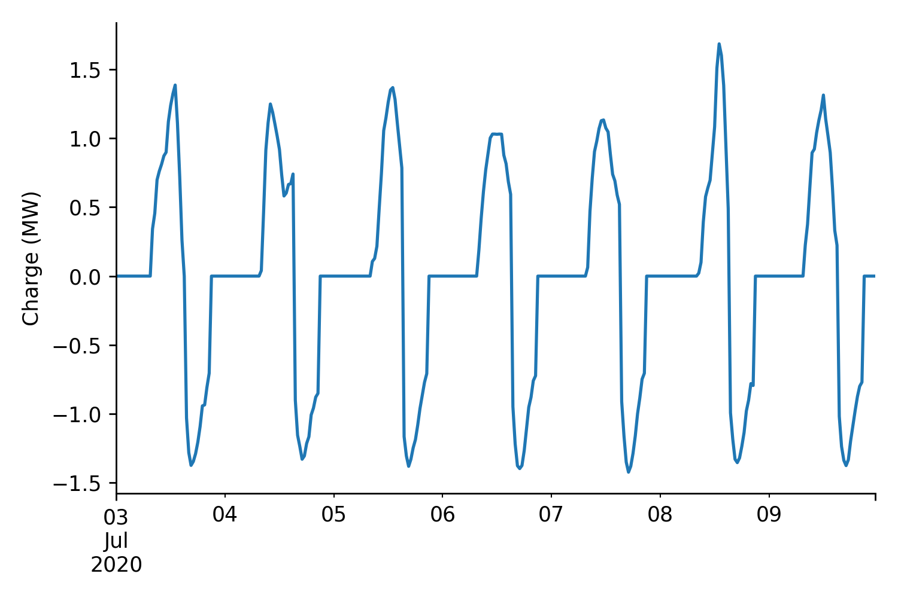

# WPD-DS-Challenge

This repository includes the workflow used by the UCL ESAIL team for submissions to the Western Power Distribition Data Science competition.

An example charging profile from our latest submission can be seen below



<br>
<br>

### Challenge Details

##### High-level Overview

* A 6MWh/2.5MW battery is connected to a primary distribution substation and a 5MW
solar farm in Devon, southwest England.
* Design the control of a storage device to support the distribution network to:
    * Maximise the daily evening peak reduction.
    * Using as much solar photovoltaic energy as possible.
* This will be done for each day for the week following the current challenge date.
* In other words it is a constrained optimisation/control problem under uncertainty.
* There will be four assessed weeks as part of this challenge.

A recording of the kick-off meeting can also be found [here](https://www.youtube.com/watch?t=1&v=Tu1bLROBNbo&feature=youtu.be&ab_channel=EnergySystemsCatapult).

<br>

##### Battery Charging

The aim of this compoennt is to maximise the proportion of the battery's charge that comes from solar PV. The total battery charge can be written as:


where  is the power drawn to the battery from solar generation on day , period  , and  is that drawn from the grid. 

Whenever the battery is charging, it will draw from solar PV as much as possible, and take the remainder from the grid. We can therefore express that for a period , the battery will draw from PV an amount:

 

The remainder is drawn from the grid: 


The proportion of energy stored in the battery from solar PV on day  is expressed as: 


An equivalent expression gives the proportion of energy stored in the battery that was drawn from the grid, .

The scoring function is proportional to . We therefore want to maximise  by coinciding our battery charging with the solar PV generation. Note that the minimum score that can be gained from this component is 1 (entirely charged from grid), and the maximum is 3 (entirely charged from solar PV).

<br>

##### Battery Discharging

We'll start by defining the cost function for the demand forecasting component of the battery discharge optimisation.

For each day (
 = 1, … , 7) the peak percentage reduction is calculated using:


Where:
*  is the average power (in MW) over the  half hour of day , where  would mean the period from midnight to 00:30 AM on the current day,  . 
*  is the average power (in MW) over the  half hour of day , to minimise the peak demand over the evening period (the half hours  = 32 to 42)

Our goal is to maximise the peak percentage reduction from 3.30PM to 9PM.

<br>

##### Constraints

We also have a number of constraints. The first constraint is on the maximum import and export of energy, in this case:


Secondly the battery cannot charge beyond its capacity, , (in MWh):


The total charge in the battery at the next time step  is related to how much is currently in the battery and how much charged within the battery at time , i.e.


Finally, the battery must start empty at the start of each day in the test week. I.e.  for .

<br>
<br>

### Literature

The literature used in this work is being tracked using Zotero within the [ESAIL group](https://www.zotero.org/groups/2739875/esail/library), please add new papers and comment on existing ones. These should hopefully make it a lot easier down the line if we turn the work into a paper.

<br>
<br>

### Environment Set-Up

The easiest way to set-up your `conda` environment is with the `setup_env.bat` script for Windows. Alternatively you can carry out these manual steps from the terminal:

```bash
> conda env create -f environment.yml
> conda activate batopt
> ipython kernel install --user --name=batopt
```


<br>
<br>

### Nb-Dev Design Approach

##### What is Nb-Dev?

> `nbdev` is a library that allows you to develop a python library in Jupyter Notebooks, putting all your code, tests and documentation in one place. That is: you now have a true literate programming environment, as envisioned by Donald Knuth back in 1983!"

<br>

##### Why use Nb-Dev?

It enables notebooks to be used as the origin of both the documentation and the code-base, improving code-readability and fitting more nicely within the standard data-science workflow. The library also provides a [several tools](https://nbdev.fast.ai/merge.html) to handle common problems such as merge issues with notebooks.

<br>

##### How to use Nb-Dev?

Most of the complexity around `nbdev` is in the initial set-up which has already been carried out for this repository, leaving the main learning curve as the special commands used in notebooks for exporting code. The special commands all have a `#` prefix and are used at the top of a cell.

* `#default_exp <sub-module-name>` - the name of the sub-module that the notebook will be outputted to (put in the first cell)
* `#exports` - to export all contents in the cell
* `#hide` - to remove the cell from the documentation

These just describe what to do with the cells though, we have to run another function to carry out this conversion (which is normally added at the end of each notebook):

```python
from nbdev.export import notebook2script
    
notebook2script()
```
