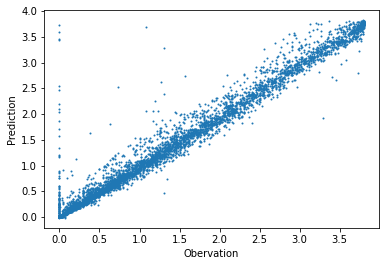

# Data Cleaning


```python
#exports
import numpy as np
import pandas as pd

import seaborn as sns
import matplotlib.pyplot as plt

from sklearn.model_selection import KFold
from sklearn.metrics import mean_absolute_error, mean_squared_error
from sklearn.linear_model import LinearRegression
from sklearn.ensemble import RandomForestRegressor, GradientBoostingRegressor

import os
import glob
from ipypb import track

from batopt import utils
```

```python
from IPython.display import JSON
```

<br>

### User Inputs

```python
raw_data_dir = '../data/raw'
cache_data_dir = '../data/nb-cache'
```

<br>

### Loading the Raw Data

We'll start by loading in the demand data

```python
#exports
def reindex_df_dt_idx(df, freq='30T'):
    full_dt_idx = pd.date_range(df.index.min(), df.index.max(), freq=freq)
    df = df.reindex(full_dt_idx)
    
    return df

def load_training_dataset(raw_data_dir: str, dataset_name: str='demand', parse_dt_idx: bool=True, dt_idx_freq: str='30T') -> pd.DataFrame:
    allowed_datasets = ['demand', 'pv', 'weather']
    assert dataset_name in allowed_datasets, f"`dataset_name` must be one of: {', '.join(allowed_datasets)} - not {dataset_name}"
    
    df = pd.concat([pd.read_csv(f) for f in glob.glob(f'{raw_data_dir}/{dataset_name}_*.csv')], ignore_index = True)
    
    if parse_dt_idx == True:
        assert 'datetime' in df.columns, 'if `parse_dt_idx` is True then `datetime` must be a column in the dataset'
        
        df['datetime'] = pd.to_datetime(df['datetime'], utc=True)
        df = df.set_index('datetime').pipe(reindex_df_dt_idx, freq=dt_idx_freq).sort_index(axis=1)
        df.index.name = 'datetime'

    return df
```

```python
df_demand = load_training_dataset(raw_data_dir, 'demand')

df_demand.head()
```


| ('Unnamed: 0_level_0', 'datetime')   |   ('demand_MW', 'Unnamed: 1_level_1') |
|:-------------------------------------|--------------------------------------:|
| 2017-11-03 00:00:00+00:00            |                                  2.19 |
| 2017-11-03 00:30:00+00:00            |                                  2.14 |
| 2017-11-03 01:00:00+00:00            |                                  2.01 |
| 2017-11-03 01:30:00+00:00            |                                  1.87 |
| 2017-11-03 02:00:00+00:00            |                                  1.86 |</div>


<br>

Then the pv

```python
df_pv = load_training_dataset(raw_data_dir, 'pv')

df_pv.head()
```


| ('Unnamed: 0_level_0', 'datetime')   |   ('irradiance_Wm-2', 'Unnamed: 1_level_1') |   ('panel_temp_C', 'Unnamed: 2_level_1') |   ('pv_power_mw', 'Unnamed: 3_level_1') |
|:-------------------------------------|--------------------------------------------:|-----------------------------------------:|----------------------------------------:|
| 2017-11-03 00:00:00+00:00            |                                           0 |                                     7.05 |                                       0 |
| 2017-11-03 00:30:00+00:00            |                                           0 |                                     7.38 |                                       0 |
| 2017-11-03 01:00:00+00:00            |                                           0 |                                     7.7  |                                       0 |
| 2017-11-03 01:30:00+00:00            |                                           0 |                                     7.48 |                                       0 |
| 2017-11-03 02:00:00+00:00            |                                           0 |                                     7.2  |                                       0 |</div>


<br>

And finally the weather

```python
df_weather = load_training_dataset(raw_data_dir, 'weather', dt_idx_freq='H')

df_weather.head(3)
```


| ('Unnamed: 0_level_0', 'datetime')   |   ('solar_location1', 'Unnamed: 1_level_1') |   ('solar_location2', 'Unnamed: 2_level_1') |   ('solar_location3', 'Unnamed: 3_level_1') |   ('solar_location4', 'Unnamed: 4_level_1') |   ('solar_location5', 'Unnamed: 5_level_1') |   ('solar_location6', 'Unnamed: 6_level_1') |   ('temp_location1', 'Unnamed: 7_level_1') |   ('temp_location2', 'Unnamed: 8_level_1') |   ('temp_location3', 'Unnamed: 9_level_1') |   ('temp_location4', 'Unnamed: 10_level_1') |   ('temp_location5', 'Unnamed: 11_level_1') |   ('temp_location6', 'Unnamed: 12_level_1') |
|:-------------------------------------|--------------------------------------------:|--------------------------------------------:|--------------------------------------------:|--------------------------------------------:|--------------------------------------------:|--------------------------------------------:|-------------------------------------------:|-------------------------------------------:|-------------------------------------------:|--------------------------------------------:|--------------------------------------------:|--------------------------------------------:|
| 2015-01-01 00:00:00+00:00            |                                           0 |                                           0 |                                           0 |                                           0 |                                           0 |                                           0 |                                       9.75 |                                       9.65 |                                       8.83 |                                        7.58 |                                       11.62 |                                       11.22 |
| 2015-01-01 01:00:00+00:00            |                                           0 |                                           0 |                                           0 |                                           0 |                                           0 |                                           0 |                                       9.91 |                                       9.76 |                                       8.9  |                                        7.62 |                                       11.65 |                                       11.32 |
| 2015-01-01 02:00:00+00:00            |                                           0 |                                           0 |                                           0 |                                           0 |                                           0 |                                           0 |                                       9.99 |                                       9.8  |                                       9.1  |                                        7.61 |                                       11.65 |                                       11.3  |</div>


single_datasets = dict()
dataset_names = ['demand', 'pv', 'weather']

for dataset_name in dataset_names:
    single_datasets[dataset_name] = load_training_dataset(raw_data_dir, dataset_name)<br>

We'll also create a function that reads all of the datasets in at once and then combines them

```python
#exports
def combine_training_datasets(raw_data_dir):
    single_datasets = dict()
    dataset_names = ['demand', 'pv', 'weather']

    for dataset_name in dataset_names:
        single_datasets[dataset_name] = load_training_dataset(raw_data_dir, dataset_name)
    
    min_dt = min([df.index.min() for df in single_datasets.values()])
    max_dt = max([df.index.max() for df in single_datasets.values()]) + pd.Timedelta(minutes=30)

    dt_rng = pd.date_range(min_dt, max_dt, freq='30T')
    df_combined = pd.DataFrame(index=dt_rng, columns=dataset_names)
    
    for dataset_name in dataset_names:
        df_single_dataset = single_datasets[dataset_name]
        cols_to_be_overwritten = set(df_combined.columns) - (set(df_combined.columns) - set(df_single_dataset.columns))
        assert len(cols_to_be_overwritten) == 0, f"The following columns exist in multiple datasets meaning data would be overwritten: {', '.join(cols_to_be_overwritten)}"

        df_combined[df_single_dataset.columns] = df_single_dataset
    
    df_combined = df_combined.sort_index()
    
    return df_combined
```

```python
df_combined = combine_training_datasets(raw_data_dir)

df_combined.head(3)
```


|                           |   demand |   pv |   weather |   demand_MW |   irradiance_Wm-2 |   panel_temp_C |   pv_power_mw |   solar_location1 |   solar_location2 |   solar_location3 |   solar_location4 |   solar_location5 |   solar_location6 |   temp_location1 |   temp_location2 |   temp_location3 |   temp_location4 |   temp_location5 |   temp_location6 |
|:--------------------------|---------:|-----:|----------:|------------:|------------------:|---------------:|--------------:|------------------:|------------------:|------------------:|------------------:|------------------:|------------------:|-----------------:|-----------------:|-----------------:|-----------------:|-----------------:|-----------------:|
| 2015-01-01 00:00:00+00:00 |      nan |  nan |       nan |         nan |               nan |            nan |           nan |                 0 |                 0 |                 0 |                 0 |                 0 |                 0 |             9.75 |             9.65 |             8.83 |             7.58 |            11.62 |            11.22 |
| 2015-01-01 00:30:00+00:00 |      nan |  nan |       nan |         nan |               nan |            nan |           nan |               nan |               nan |               nan |               nan |               nan |               nan |           nan    |           nan    |           nan    |           nan    |           nan    |           nan    |
| 2015-01-01 01:00:00+00:00 |      nan |  nan |       nan |         nan |               nan |            nan |           nan |                 0 |                 0 |                 0 |                 0 |                 0 |                 0 |             9.91 |             9.76 |             8.9  |             7.62 |            11.65 |            11.32 |</div>


<br>

### Identifying Missing Values

We'll quickly inspect the datasets and check their coverage over the full date range when aggregated by dataset

```python
#exports
def identify_df_dt_entries(df_demand, df_pv, df_weather):
    min_dt = min(df_demand.index.min(), df_pv.index.min(), df_weather.index.min())
    max_dt = max(df_demand.index.max(), df_pv.index.max(), df_weather.index.max())
    
    dt_rng = pd.date_range(min_dt, max_dt, freq='30T')
    df_nulls = pd.DataFrame(index=dt_rng)
    
    df_nulls['demand'] = df_demand.reindex(dt_rng).isnull().mean(axis=1).astype(int)
    df_nulls['pv'] = df_pv.reindex(dt_rng).isnull().mean(axis=1).astype(int)
    df_nulls['weather'] = df_weather.reindex(dt_rng).ffill(limit=1).isnull().mean(axis=1).astype(int)
    
    df_entries = 1 - df_nulls
    
    return df_entries
```

```python
df_entries = identify_df_dt_entries(df_demand, df_pv, df_weather)

# Plotting
fig, ax = plt.subplots(dpi=150)

sns.heatmap(df_entries.T, ax=ax, cmap=plt.cm.binary)

utils.set_date_ticks(ax, '2015-01-01', '2018-07-31', axis='x', freq='Qs', date_format='%b %y')
```


    <AxesSubplot:>


<br>

We'll also determine the null percentage in each individual column

```python
df_demand.isnull().mean()
```


    demand_MW    0.0
    dtype: float64


<br>

We can see that all of the PV data columns are missing some data

```python
df_pv.isnull().mean()
```


    irradiance_Wm-2    0.001590
    panel_temp_C       0.005725
    pv_power_mw        0.001590
    dtype: float64


<br>

Location 2 is also missing some solar data

```python
df_weather.isnull().mean()
```


    solar_location1    0.000000
    solar_location2    0.000766
    solar_location3    0.000000
    solar_location4    0.000000
    solar_location5    0.000000
    solar_location6    0.000000
    temp_location1     0.000000
    temp_location2     0.000000
    temp_location3     0.000000
    temp_location4     0.000000
    temp_location5     0.000000
    temp_location6     0.000000
    dtype: float64


```python
# !!! We also need to handle the two days where demand is constantly 0 !!!
# Separately it looks like there's also some anomalous 0 readings for the PV output
```

```python
(df_demand==0).sum()
```


    demand_MW    58
    dtype: int64


```python
df_demand.query('demand_MW==0').head()
```


| ('Unnamed: 0_level_0', 'datetime')   |   ('demand_MW', 'Unnamed: 1_level_1') |
|:-------------------------------------|--------------------------------------:|
| 2018-05-08 08:00:00+00:00            |                                     0 |
| 2018-05-08 08:30:00+00:00            |                                     0 |
| 2018-05-08 09:00:00+00:00            |                                     0 |
| 2018-05-08 09:30:00+00:00            |                                     0 |
| 2018-05-08 10:00:00+00:00            |                                     0 |</div>


<br>

### Handling Missing Values

We'll start by interpolating the missing PV data, first checking the number of variables that have null values for each time period

```python
s_pv_num_null_vals = df_pv.isnull().sum(axis=1).replace(0, np.nan).dropna().astype(int)

s_pv_num_null_vals.value_counts()
```


    1    52
    3    20
    dtype: int64


<br>

`pv_power_mw` and `irradiance_Wm-2` have the same average number of null values, there are also no time-periods where only 2 variables have null values - it's therefore likely that power and irradiance always have null periods at the same time which makes it harder to interpolate their values. We'll quickly check this hypothesis:

```python
(df_pv['pv_power_mw'].isnull() == df_pv['irradiance_Wm-2'].isnull()).mean() == 1
```


    True


<br>

It appears as though the `pv_power_mw` and `irradiance_Wm-2` missing values are a single time-block that coincides with a larger set of missing values within `panel_temp_C`.

```python
df_pv[df_pv['pv_power_mw'].isnull()]
```


| ('Unnamed: 0_level_0', 'datetime')   |   ('irradiance_Wm-2', 'Unnamed: 1_level_1') |   ('panel_temp_C', 'Unnamed: 2_level_1') |   ('pv_power_mw', 'Unnamed: 3_level_1') |
|:-------------------------------------|--------------------------------------------:|-----------------------------------------:|----------------------------------------:|
| 2018-03-04 07:00:00+00:00            |                                         nan |                                      nan |                                     nan |
| 2018-03-04 07:30:00+00:00            |                                         nan |                                      nan |                                     nan |
| 2018-03-04 08:00:00+00:00            |                                         nan |                                      nan |                                     nan |
| 2018-03-04 08:30:00+00:00            |                                         nan |                                      nan |                                     nan |
| 2018-03-04 09:00:00+00:00            |                                         nan |                                      nan |                                     nan |
| 2018-03-04 09:30:00+00:00            |                                         nan |                                      nan |                                     nan |
| 2018-03-04 10:00:00+00:00            |                                         nan |                                      nan |                                     nan |
| 2018-03-04 10:30:00+00:00            |                                         nan |                                      nan |                                     nan |
| 2018-03-04 11:00:00+00:00            |                                         nan |                                      nan |                                     nan |
| 2018-03-04 11:30:00+00:00            |                                         nan |                                      nan |                                     nan |
| 2018-03-04 12:00:00+00:00            |                                         nan |                                      nan |                                     nan |
| 2018-03-04 12:30:00+00:00            |                                         nan |                                      nan |                                     nan |
| 2018-03-04 13:00:00+00:00            |                                         nan |                                      nan |                                     nan |
| 2018-03-04 13:30:00+00:00            |                                         nan |                                      nan |                                     nan |
| 2018-03-04 14:00:00+00:00            |                                         nan |                                      nan |                                     nan |
| 2018-03-04 15:00:00+00:00            |                                         nan |                                      nan |                                     nan |
| 2018-03-04 15:30:00+00:00            |                                         nan |                                      nan |                                     nan |
| 2018-03-04 16:00:00+00:00            |                                         nan |                                      nan |                                     nan |
| 2018-03-04 16:30:00+00:00            |                                         nan |                                      nan |                                     nan |
| 2018-03-04 17:00:00+00:00            |                                         nan |                                      nan |                                     nan |</div>


<br>

Looking at the `panel_temp_C` data we can see there are 3 time-blocks where obervations are missing 

```python
df_pv['panel_temp_C'].isnull().astype(int).plot()
```


    <AxesSubplot:xlabel='datetime'>


<br>

One option might to be replace the missing temperature values with the temperatures observed at the surrounding weather grid locations, we'll start by constructing a dataframe that includes all of the temperature data as well as the average rolling temperature for each weather data location.

```python
#exports
def construct_df_temp_features(df_weather, df_pv):
    df_weather = df_weather.reindex(pd.date_range(df_weather.index.min(), df_weather.index.max(), freq='30T')).ffill(limit=1)
    temp_loc_cols = df_weather.columns[df_weather.columns.str.contains('temp')]
    
    df_temp_features = (df_weather
                        .copy()
                        [temp_loc_cols]
                        .assign(site_temp=df_pv['panel_temp_C'])
                       )

    df_temp_features[[col+'_rolling' for col in temp_loc_cols]] = df_temp_features.rolling(3).mean()[temp_loc_cols]

    df_temp_features = df_temp_features.sort_index(axis=1)

    return df_temp_features
```

```python
df_temp_features = construct_df_temp_features(df_weather, df_pv).dropna()

df_temp_features.head()
```


|                           |   site_temp |   temp_location1 |   temp_location1_rolling |   temp_location2 |   temp_location2_rolling |   temp_location3 |   temp_location3_rolling |   temp_location4 |   temp_location4_rolling |   temp_location5 |   temp_location5_rolling |   temp_location6 |   temp_location6_rolling |
|:--------------------------|------------:|-----------------:|-------------------------:|-----------------:|-------------------------:|-----------------:|-------------------------:|-----------------:|-------------------------:|-----------------:|-------------------------:|-----------------:|-------------------------:|
| 2017-11-03 00:00:00+00:00 |        7.05 |             8.56 |                  8.62667 |             9.64 |                  9.66    |             7.46 |                  7.78667 |             6.68 |                  6.93333 |            13.09 |                  13.0233 |            13.2  |                  13.1133 |
| 2017-11-03 00:30:00+00:00 |        7.38 |             8.56 |                  8.59333 |             9.64 |                  9.65    |             7.46 |                  7.62333 |             6.68 |                  6.80667 |            13.09 |                  13.0567 |            13.2  |                  13.1567 |
| 2017-11-03 01:00:00+00:00 |        7.7  |             8.69 |                  8.60333 |             9.71 |                  9.66333 |             7.14 |                  7.35333 |             6.27 |                  6.54333 |            13.21 |                  13.13   |            13.32 |                  13.24   |
| 2017-11-03 01:30:00+00:00 |        7.48 |             8.69 |                  8.64667 |             9.71 |                  9.68667 |             7.14 |                  7.24667 |             6.27 |                  6.40667 |            13.21 |                  13.17   |            13.32 |                  13.28   |
| 2017-11-03 02:00:00+00:00 |        7.2  |             8.74 |                  8.70667 |             9.73 |                  9.71667 |             6.86 |                  7.04667 |             5.91 |                  6.15    |            13.3  |                  13.24   |            13.36 |                  13.3333 |</div>


<br>

We'll now check the correlation

```python
sns.heatmap(df_temp_features.corr())
```


    <AxesSubplot:>


<br>

The correlation drops off quickly when it gets to the site temperature, looking at the full distributions we can see that the site measurements get far higher. This is because the panel is absorbing heat that raises its temperature above that of the surrounding area, again making it more difficult to simply fill in with the nearby temperature measurements.

```python
sns.distplot(df_temp_features['site_temp'], color='C0', label='Panel')
sns.distplot(df_temp_features.drop('site_temp', axis=1).min(axis=1), color='C1', label='MERRA Min')
sns.distplot(df_temp_features.drop('site_temp', axis=1).max(axis=1), color='C2', label='MERRA Max')

plt.legend(frameon=False)
```

    C:\Users\Ayrto\anaconda3\envs\batopt\lib\site-packages\seaborn\distributions.py:2557: FutureWarning: `distplot` is a deprecated function and will be removed in a future version. Please adapt your code to use either `displot` (a figure-level function with similar flexibility) or `histplot` (an axes-level function for histograms).
      warnings.warn(msg, FutureWarning)
    C:\Users\Ayrto\anaconda3\envs\batopt\lib\site-packages\seaborn\distributions.py:2557: FutureWarning: `distplot` is a deprecated function and will be removed in a future version. Please adapt your code to use either `displot` (a figure-level function with similar flexibility) or `histplot` (an axes-level function for histograms).
      warnings.warn(msg, FutureWarning)
    C:\Users\Ayrto\anaconda3\envs\batopt\lib\site-packages\seaborn\distributions.py:2557: FutureWarning: `distplot` is a deprecated function and will be removed in a future version. Please adapt your code to use either `displot` (a figure-level function with similar flexibility) or `histplot` (an axes-level function for histograms).
      warnings.warn(msg, FutureWarning)
    


    <matplotlib.legend.Legend at 0x15e3f226940>


```python
# Could use an RF to estimate the panel temp based on the weather grid temps?
# Potential features: current average surrounding temp, average surrounding temp over the last 3 hours
```

```python
#exports
def split_X_y_data(df, target_col='site_temp'):
    df = df.dropna()
    X_cols = df.drop(target_col, axis=1).columns

    X = df[X_cols].values
    y = df[target_col].values
    
    return X, y

def split_X_y_data_with_index(df, target_col='site_temp'):
    df = df.dropna()
    X_cols = df.drop(target_col, axis=1).columns

    X = df[X_cols].values
    y = df[target_col].values
    index = df.index
    
    return X, y, index
```

```python
X, y = split_X_y_data(df_temp_features)

X.shape, y.shape
```


    ((12504, 12), (12504,))


```python
#exports
def generate_kfold_preds(
    X, 
    y, 
    model=LinearRegression(), 
    kfold_kwargs={'n_splits': 5, 'shuffle': True},
    index=None
):

    kfold = KFold(**kfold_kwargs)
    df_pred = pd.DataFrame(columns=['pred', 'true'], index=np.arange(X.shape[0]))

    for train_idxs, test_idxs in kfold.split(X):
        X_train, y_train = X[train_idxs], y[train_idxs]
        X_test, y_test = X[test_idxs], y[test_idxs]
    
        model.fit(X_train, y_train)
        
        df_pred.loc[test_idxs, 'true'] = y_test
        df_pred.loc[test_idxs, 'pred'] = model.predict(X_test)
        
    df_pred = df_pred.sort_index()
    
    if index is not None:
        assert len(index) == df_pred.shape[0], 'The passed index must be the same length as X and y'
        df_pred.index = index
        
    return df_pred
```

```python
df_pred = generate_kfold_preds(X, y)

df_pred.head()
```


|    |    pred |   true |
|---:|--------:|-------:|
|  0 | 5.19665 |   7.05 |
|  1 | 5.57765 |   7.38 |
|  2 | 5.94208 |   7.7  |
|  3 | 6.07092 |   7.48 |
|  4 | 5.77677 |   7.2  |</div>


```python
#exports
def evaluate_models(X, y, models, post_pred_proc_func=None, index=None):
    model_scores = dict()

    for model_name, model in track(models.items()):
        df_pred = generate_kfold_preds(X, y, model, index=index)
        
        if post_pred_proc_func is not None:
            df_pred['pred'] = post_pred_proc_func(df_pred['pred'])

        model_scores[model_name] = {
            'mae': mean_absolute_error(df_pred['true'], df_pred['pred']),
            'rmse': np.sqrt(mean_squared_error(df_pred['true'], df_pred['pred']))
        }

    df_model_scores = pd.DataFrame(model_scores)
    
    df_model_scores.index.name = 'metric'
    df_model_scores.columns.name = 'model'

    return df_model_scores
```

```python
models = {
    'std_linear': LinearRegression(),
    'random_forest': RandomForestRegressor(),
    'boosted': GradientBoostingRegressor()
}

rerun_panel_temp_model = False
model_scores_filename = 'panel_temp_interp_model_results.csv'

if (rerun_panel_temp_model == True) or (model_scores_filename not in os.listdir(cache_data_dir)):
    df_model_scores = evaluate_models(X, y, models)
    df_model_scores.to_csv(f'{cache_data_dir}/{model_scores_filename}')
else:
    df_model_scores = pd.read_csv(f'{cache_data_dir}/{model_scores_filename}', index_col='metric')

df_model_scores
```


| ('Unnamed: 0_level_0', 'metric')   |   ('std_linear', 'Unnamed: 1_level_1') |   ('random_forest', 'Unnamed: 2_level_1') |   ('boosted', 'Unnamed: 3_level_1') |
|:-----------------------------------|---------------------------------------:|------------------------------------------:|------------------------------------:|
| mae                                |                                2.81922 |                                   1.68451 |                             2.58143 |
| rmse                               |                                3.78674 |                                   2.69334 |                             3.73415 |</div>


```python
top_model = df_model_scores.T['rmse'].idxmin()
df_pred = generate_kfold_preds(X, y, models[top_model])

df_pred.head()
```


|    |   pred |   true |
|---:|-------:|-------:|
|  0 | 7.1133 |   7.05 |
|  1 | 7.1721 |   7.38 |
|  2 | 7.3059 |   7.7  |
|  3 | 7.5396 |   7.48 |
|  4 | 7.5324 |   7.2  |</div>


```python
s_residuals = df_pred.diff(1, axis=1).dropna(axis=1).iloc[:, 0]

s_residuals.plot(linewidth=0.3)
```


    <AxesSubplot:>


```python
plt.scatter(df_pred['true'], df_pred['pred'], s=1)

plt.xlabel('Obervation')
plt.ylabel('Prediction')
```


    Text(0, 0.5, 'Prediction')


```python
#exports
def interpolate_missing_panel_temps(df_pv, df_weather, model=RandomForestRegressor()):
    missing_panel_temp_dts = df_pv.index[df_pv['panel_temp_C'].isnull()]
    
    if len(missing_panel_temp_dts) == 0: # i.e. no missing values
        return df_pv

    df_temp_features = construct_df_temp_features(df_weather, df_pv)
    missing_dt_X = df_temp_features.loc[missing_panel_temp_dts].drop('site_temp', axis=1).values
    X, y = split_X_y_data(df_temp_features, 'site_temp')
    
    model.fit(X, y)
    df_pv.loc[missing_panel_temp_dts, 'panel_temp_C'] = model.predict(missing_dt_X)
    
    assert df_pv['panel_temp_C'].isnull().sum() == 0, 'There are still null values for the PV panel temperature'
    
    return df_pv
```

```python
df_pv = interpolate_missing_panel_temps(df_pv, df_weather)

df_pv.isnull().mean()
```


    irradiance_Wm-2    0.00159
    panel_temp_C       0.00000
    pv_power_mw        0.00159
    dtype: float64


```python
#exports
def construct_df_irradiance_features(df_weather, df_pv):
    df_weather = df_weather.reindex(pd.date_range(df_weather.index.min(), df_weather.index.max(), freq='30T')).ffill(limit=1)
    temp_loc_cols = df_weather.columns[df_weather.columns.str.contains('solar')]
    
    df_irradiance_features = (df_weather
                              .copy()
                              [temp_loc_cols]
                              .assign(site_solar=df_pv['irradiance_Wm-2'])
                              .pipe(lambda df: df.assign(hour=df.index.hour + df.index.minute/60))
                             )

    df_irradiance_features = df_irradiance_features.sort_index(axis=1)

    return df_irradiance_features
```

```python
df_irradiance_features = construct_df_irradiance_features(df_weather, df_pv)

df_irradiance_features.head()
```


|                           |   hour |   site_solar |   solar_location1 |   solar_location2 |   solar_location3 |   solar_location4 |   solar_location5 |   solar_location6 |
|:--------------------------|-------:|-------------:|------------------:|------------------:|------------------:|------------------:|------------------:|------------------:|
| 2015-01-01 00:00:00+00:00 |    0   |          nan |                 0 |                 0 |                 0 |                 0 |                 0 |                 0 |
| 2015-01-01 00:30:00+00:00 |    0.5 |          nan |                 0 |                 0 |                 0 |                 0 |                 0 |                 0 |
| 2015-01-01 01:00:00+00:00 |    1   |          nan |                 0 |                 0 |                 0 |                 0 |                 0 |                 0 |
| 2015-01-01 01:30:00+00:00 |    1.5 |          nan |                 0 |                 0 |                 0 |                 0 |                 0 |                 0 |
| 2015-01-01 02:00:00+00:00 |    2   |          nan |                 0 |                 0 |                 0 |                 0 |                 0 |                 0 |</div>


```python
models = {
    'std_linear': LinearRegression(),
    'random_forest': RandomForestRegressor(),
    'boosted': GradientBoostingRegressor()
}

rerun_site_irradiance_model = False
model_scores_filename = 'site_irradiance_interp_model_results.csv'

X, y = split_X_y_data(df_irradiance_features, 'site_solar')

if (rerun_site_irradiance_model == True) or (model_scores_filename not in os.listdir(cache_data_dir)):
    df_model_scores = evaluate_models(X, y, models)
    df_model_scores.to_csv(f'{cache_data_dir}/{model_scores_filename}')
else:
    df_model_scores = pd.read_csv(f'{cache_data_dir}/{model_scores_filename}', index_col='metric')

df_model_scores
```


| ('Unnamed: 0_level_0', 'metric')   |   ('std_linear', 'Unnamed: 1_level_1') |   ('random_forest', 'Unnamed: 2_level_1') |   ('boosted', 'Unnamed: 3_level_1') |
|:-----------------------------------|---------------------------------------:|------------------------------------------:|------------------------------------:|
| mae                                |                                57.4977 |                                   37.5087 |                             49.6956 |
| rmse                               |                               110.546  |                                   78.8525 |                             99.1964 |</div>


```python
top_model = df_model_scores.T['rmse'].idxmin()
df_pred = generate_kfold_preds(X, y, models[top_model])

df_pred.head()
```


|    |     pred |   true |
|---:|---------:|-------:|
|  0 | 0        |      0 |
|  1 | 0        |      0 |
|  2 | 0        |      0 |
|  3 | 0.000181 |      0 |
|  4 | 0        |      0 |</div>


```python
plt.scatter(df_pred['true'], df_pred['pred'], s=1)

plt.xlabel('Obervation')
plt.ylabel('Prediction')
```


    Text(0, 0.5, 'Prediction')


```python
#exports
def interpolate_missing_site_irradiance(df_pv, df_weather, model=RandomForestRegressor()):
    missing_site_irradiance_dts = df_pv.index[df_pv['irradiance_Wm-2'].isnull()]
    
    if len(missing_site_irradiance_dts) == 0: # i.e. no missing values
        return df_pv

    df_irradiance_features = construct_df_irradiance_features(df_weather, df_pv)
    missing_dt_X = df_irradiance_features.loc[missing_site_irradiance_dts].drop('site_solar', axis=1).values
    X, y = split_X_y_data(df_irradiance_features, 'site_solar')
 
    model.fit(X, y)
    df_pv.loc[missing_site_irradiance_dts, 'irradiance_Wm-2'] = model.predict(missing_dt_X)
    
    assert df_pv['irradiance_Wm-2'].isnull().sum() == 0, 'There are still null values for the solar site irradiance'
    
    return df_pv
```

```python
df_pv = interpolate_missing_site_irradiance(df_pv, df_weather)

df_pv.isnull().mean()
```


    irradiance_Wm-2    0.00000
    panel_temp_C       0.00000
    pv_power_mw        0.00159
    dtype: float64


<br>

Now that we have the irradiance and temperature we're ready to start filling in the missing values for power output, again using the same regression interpolation method

```python
#exports
def construct_df_power_features(df_pv):
    df_power_features = (df_pv
                         .pipe(lambda df: df.assign(hour=df.index.hour + df.index.minute/60))
                         .sort_index(axis=1)
                        )

    return df_power_features
```

```python
df_power_features = construct_df_power_features(df_pv)

df_power_features.head()
```


| ('Unnamed: 0_level_0', 'datetime')   |   ('hour', 'Unnamed: 1_level_1') |   ('irradiance_Wm-2', 'Unnamed: 2_level_1') |   ('panel_temp_C', 'Unnamed: 3_level_1') |   ('pv_power_mw', 'Unnamed: 4_level_1') |
|:-------------------------------------|---------------------------------:|--------------------------------------------:|-----------------------------------------:|----------------------------------------:|
| 2017-11-03 00:00:00+00:00            |                              0   |                                           0 |                                     7.05 |                                       0 |
| 2017-11-03 00:30:00+00:00            |                              0.5 |                                           0 |                                     7.38 |                                       0 |
| 2017-11-03 01:00:00+00:00            |                              1   |                                           0 |                                     7.7  |                                       0 |
| 2017-11-03 01:30:00+00:00            |                              1.5 |                                           0 |                                     7.48 |                                       0 |
| 2017-11-03 02:00:00+00:00            |                              2   |                                           0 |                                     7.2  |                                       0 |</div>


```python
models = {
    'std_linear': LinearRegression(),
    'random_forest': RandomForestRegressor(),
    'boosted': GradientBoostingRegressor()
}

rerun_site_power_model = False
model_scores_filename = 'site_power_interp_model_results.csv'

X, y, dates = split_X_y_data_with_index(df_power_features, 'pv_power_mw')

if (rerun_site_power_model == True) or (model_scores_filename not in os.listdir(cache_data_dir)):
    df_model_scores = evaluate_models(X, y, models)
    df_model_scores.to_csv(f'{cache_data_dir}/{model_scores_filename}')
else:
    df_model_scores = pd.read_csv(f'{cache_data_dir}/{model_scores_filename}', index_col='metric')

df_model_scores
```


| ('Unnamed: 0_level_0', 'metric')   |   ('std_linear', 'Unnamed: 1_level_1') |   ('random_forest', 'Unnamed: 2_level_1') |   ('boosted', 'Unnamed: 3_level_1') |
|:-----------------------------------|---------------------------------------:|------------------------------------------:|------------------------------------:|
| mae                                |                               0.061519 |                                  0.041122 |                            0.043927 |
| rmse                               |                               0.14598  |                                  0.135822 |                            0.133212 |</div>


```python
top_model = df_model_scores.T['rmse'].idxmin()
df_pred = generate_kfold_preds(X, y, models[top_model])

df_pred.head()
```


|    |      pred |   true |
|---:|----------:|-------:|
|  0 | -0.000348 |      0 |
|  1 |  0.000689 |      0 |
|  2 | -0.000551 |      0 |
|  3 |  0.000689 |      0 |
|  4 |  0.000316 |      0 |</div>


```python
plt.scatter(df_pred['true'], df_pred['pred'], s=1)

plt.xlabel('Obervation')
plt.ylabel('Prediction')
```


    Text(0, 0.5, 'Prediction')





##### Anomalous data points in PV data

The PV data shows a number of points where the observed value is 0 but the prediction is much higher. 

First let's try and identify them (setting the tolerance to be lower will capture more values as anomalous). 

```python
def identify_anomalies_pv(df_pred, tolerance=0.2):
    foo = df_pred.copy()
    foo['difference'] = foo.pred - foo.true
    foo = foo[(foo.difference > tolerance) & (foo.true == 0)]
    return foo.index

anomalous_dates = dates[identify_anomalies_pv(df_pred)]
anomalous_df = df_power_features[df_power_features.index.isin(anomalous_dates)]
plt.hist(anomalous_df.hour) # Check this histogram to eyeball if any unreasonable anomalous values are caught by the tolerance (e.g. late at night)
```


    (array([ 3.,  3.,  6., 10., 10., 10., 10.,  5.,  2.,  4.]),
     array([ 6.5 ,  7.65,  8.8 ,  9.95, 11.1 , 12.25, 13.4 , 14.55, 15.7 ,
            16.85, 18.  ]),
     <BarContainer object of 10 artists>)


Replace these values in `df_power_features`. 

```python
df_power_features_clean = df_power_features.copy()
df_power_features_clean.loc[df_power_features_clean.index.isin(anomalous_dates), 'pv_power_mw'] = np.nan
```

Rerun the previous model fitting and check the pred vs. actual graph. 

```python
models = {
    'std_linear': LinearRegression(),
    'random_forest': RandomForestRegressor(),
    'boosted': GradientBoostingRegressor()
}

rerun_site_power_model = False
model_scores_filename = 'site_power_interp_clean_model_results.csv'

X, y, dates = split_X_y_data_with_index(df_power_features_clean, 'pv_power_mw')

if (rerun_site_power_model == True) or (model_scores_filename not in os.listdir(cache_data_dir)):
    df_model_scores = evaluate_models(X, y, models)
    df_model_scores.to_csv(f'{cache_data_dir}/{model_scores_filename}')
else:
    df_model_scores = pd.read_csv(f'{cache_data_dir}/{model_scores_filename}', index_col='metric')

top_model = df_model_scores.T['rmse'].idxmin()
df_pred = generate_kfold_preds(X, y, models[top_model])

plt.scatter(df_pred['true'], df_pred['pred'], s=1)

plt.xlabel('Obervation')
plt.ylabel('Prediction')
```


    Text(0, 0.5, 'Prediction')


The above graph looks to be a cleaner with tolerance at 0.2. It looks like there might still be some which aren't though. Consider lowering the tolerance.

```python
#exports
def interpolate_missing_site_power(df_pv, model=RandomForestRegressor()):
    missing_site_power_dts = df_pv.index[df_pv['pv_power_mw'].isnull()]
    
    if len(missing_site_power_dts) == 0: # i.e. no missing values
        return df_pv

    df_power_features = construct_df_power_features(df_pv)
    missing_dt_X = df_power_features.loc[missing_site_power_dts].drop('pv_power_mw', axis=1).values
    X, y = split_X_y_data(df_power_features, 'pv_power_mw')
 
    model.fit(X, y)
    df_pv.loc[missing_site_power_dts, 'pv_power_mw'] = model.predict(missing_dt_X)
    
    assert df_pv['pv_power_mw'].isnull().sum() == 0, 'There are still null values for the solar site power'
    
    return df_pv
```

```python
df_pv = interpolate_missing_site_power(df_pv)

df_pv.isnull().mean()
```


    irradiance_Wm-2    0.0
    panel_temp_C       0.0
    pv_power_mw        0.0
    dtype: float64


```python
#exports
def interpolate_missing_weather_solar(df_pv, df_weather, weather_col='solar_location2', model=RandomForestRegressor()):
    missing_weather_solar_dts = df_weather.index[df_weather[weather_col].isnull()]
    
    if len(missing_weather_solar_dts) == 0: # i.e. no missing values
        return df_pv

    df_irradiance_features = construct_df_irradiance_features(df_weather, df_pv).drop('site_solar', axis=1)
    missing_dt_X = df_irradiance_features.loc[missing_weather_solar_dts].drop(weather_col, axis=1).values
    X, y = split_X_y_data(df_irradiance_features, weather_col)
 
    model.fit(X, y)
    df_weather.loc[missing_weather_solar_dts, weather_col] = model.predict(missing_dt_X)
    
    assert df_weather[weather_col].isnull().sum() == 0, 'There are still null values for the weather dataset solar observations'
    
    return df_weather
```

```python
df_weather = interpolate_missing_weather_solar(df_pv, df_weather)

df_weather.isnull().mean()
```


    solar_location1    0.0
    solar_location2    0.0
    solar_location3    0.0
    solar_location4    0.0
    solar_location5    0.0
    solar_location6    0.0
    temp_location1     0.0
    temp_location2     0.0
    temp_location3     0.0
    temp_location4     0.0
    temp_location5     0.0
    temp_location6     0.0
    dtype: float64


<br>

Finally we'll export the relevant code to our `batopt` module
