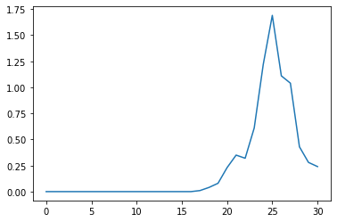

# Data Loading


```python
import pandas as pd

import seaborn as sns
import matplotlib.pyplot as plt

from batopt import utils

import os
import glob
```

<br>

### User Inputs

```python
raw_data_dir = '../data/raw'
```

<br>

### Loading the Raw Data

We'll start by loading in the demand data

```python
#exports
def load_training_dataset(raw_data_dir: str, dataset_name: str='demand', parse_dt_idx: bool=True) -> pd.DataFrame:
    allowed_datasets = ['demand', 'pv', 'weather']
    assert dataset_name in allowed_datasets, f"`dataset_name` must be one of: {', '.join(allowed_datasets)} - not {dataset_name}"
    
    df = pd.concat([pd.read_csv(f) for f in glob.glob(f'{raw_data_dir}/{dataset_name}_*.csv')], ignore_index = True)
    
    if parse_dt_idx == True:
        assert 'datetime' in df.columns, 'if `parse_dt_idx` is True then `datetime` must be a column in the dataset'
        
        df['datetime'] = pd.to_datetime(df['datetime'])
        df = df.set_index('datetime')

    return df
```

```python
df_demand = load_training_dataset(raw_data_dir, 'demand')

df_demand.head()
```


| ('Unnamed: 0_level_0', 'datetime')   |   ('demand_MW', 'Unnamed: 1_level_1') |
|:-------------------------------------|--------------------------------------:|
| 2017-11-03 00:00:00                  |                                  2.19 |
| 2017-11-03 00:30:00                  |                                  2.14 |
| 2017-11-03 01:00:00                  |                                  2.01 |
| 2017-11-03 01:30:00                  |                                  1.87 |
| 2017-11-03 02:00:00                  |                                  1.86 |</div>


<br>

Then the pv

```python
df_pv = load_training_dataset(raw_data_dir, 'pv')

df_pv.head()
```


| ('Unnamed: 0_level_0', 'datetime')   |   ('irradiance_Wm-2', 'Unnamed: 1_level_1') |   ('pv_power_mw', 'Unnamed: 2_level_1') |   ('panel_temp_C', 'Unnamed: 3_level_1') |
|:-------------------------------------|--------------------------------------------:|----------------------------------------:|-----------------------------------------:|
| 2017-11-03 00:00:00                  |                                           0 |                                       0 |                                     7.05 |
| 2017-11-03 00:30:00                  |                                           0 |                                       0 |                                     7.38 |
| 2017-11-03 01:00:00                  |                                           0 |                                       0 |                                     7.7  |
| 2017-11-03 01:30:00                  |                                           0 |                                       0 |                                     7.48 |
| 2017-11-03 02:00:00                  |                                           0 |                                       0 |                                     7.2  |</div>


<br>

And finally the weather

```python
df_weather = load_training_dataset(raw_data_dir, 'weather').sort_index(axis=1)

df_weather.head(3)
```


| ('Unnamed: 0_level_0', 'datetime')   |   ('solar_location1', 'Unnamed: 1_level_1') |   ('solar_location2', 'Unnamed: 2_level_1') |   ('solar_location3', 'Unnamed: 3_level_1') |   ('solar_location4', 'Unnamed: 4_level_1') |   ('solar_location5', 'Unnamed: 5_level_1') |   ('solar_location6', 'Unnamed: 6_level_1') |   ('temp_location1', 'Unnamed: 7_level_1') |   ('temp_location2', 'Unnamed: 8_level_1') |   ('temp_location3', 'Unnamed: 9_level_1') |   ('temp_location4', 'Unnamed: 10_level_1') |   ('temp_location5', 'Unnamed: 11_level_1') |   ('temp_location6', 'Unnamed: 12_level_1') |
|:-------------------------------------|--------------------------------------------:|--------------------------------------------:|--------------------------------------------:|--------------------------------------------:|--------------------------------------------:|--------------------------------------------:|-------------------------------------------:|-------------------------------------------:|-------------------------------------------:|--------------------------------------------:|--------------------------------------------:|--------------------------------------------:|
| 2015-01-01 00:00:00                  |                                           0 |                                           0 |                                           0 |                                           0 |                                           0 |                                           0 |                                       9.75 |                                       9.65 |                                       8.83 |                                        7.58 |                                       11.62 |                                       11.22 |
| 2015-01-01 01:00:00                  |                                           0 |                                           0 |                                           0 |                                           0 |                                           0 |                                           0 |                                       9.91 |                                       9.76 |                                       8.9  |                                        7.62 |                                       11.65 |                                       11.32 |
| 2015-01-01 02:00:00                  |                                           0 |                                           0 |                                           0 |                                           0 |                                           0 |                                           0 |                                       9.99 |                                       9.8  |                                       9.1  |                                        7.61 |                                       11.65 |                                       11.3  |</div>


<br>

We'll also create a function that reads all of the datasets in at once and then combines them

```python
#exports
def combine_training_datasets(raw_data_dir):
    df_combined = pd.DataFrame()

    for dataset_name in ['demand', 'pv', 'weather']:
        df_single_dataset = load_training_dataset(raw_data_dir, dataset_name)

        cols_to_be_overwritten = set(df_combined.columns) - (set(df_combined.columns) - set(df_single_dataset.columns))
        assert len(cols_to_be_overwritten) == 0, f"The following columns exist in multiple datasets meaning data would be overwritten: {', '.join(cols_to_be_overwritten)}"

        df_combined = df_combined.append(df_single_dataset)
    
    df_combined = df_combined.sort_index()
    
    return df_combined
```

```python
df_combined = combine_training_datasets(raw_data_dir)

df_combined.head(3)
```


| ('Unnamed: 0_level_0', 'datetime')   |   ('demand_MW', 'Unnamed: 1_level_1') |   ('irradiance_Wm-2', 'Unnamed: 2_level_1') |   ('pv_power_mw', 'Unnamed: 3_level_1') |   ('panel_temp_C', 'Unnamed: 4_level_1') |   ('temp_location3', 'Unnamed: 5_level_1') |   ('temp_location6', 'Unnamed: 6_level_1') |   ('temp_location2', 'Unnamed: 7_level_1') |   ('temp_location4', 'Unnamed: 8_level_1') |   ('temp_location5', 'Unnamed: 9_level_1') |   ('temp_location1', 'Unnamed: 10_level_1') |   ('solar_location3', 'Unnamed: 11_level_1') |   ('solar_location6', 'Unnamed: 12_level_1') |   ('solar_location2', 'Unnamed: 13_level_1') |   ('solar_location4', 'Unnamed: 14_level_1') |   ('solar_location5', 'Unnamed: 15_level_1') |   ('solar_location1', 'Unnamed: 16_level_1') |
|:-------------------------------------|--------------------------------------:|--------------------------------------------:|----------------------------------------:|-----------------------------------------:|-------------------------------------------:|-------------------------------------------:|-------------------------------------------:|-------------------------------------------:|-------------------------------------------:|--------------------------------------------:|---------------------------------------------:|---------------------------------------------:|---------------------------------------------:|---------------------------------------------:|---------------------------------------------:|---------------------------------------------:|
| 2015-01-01 00:00:00                  |                                   nan |                                         nan |                                     nan |                                      nan |                                       8.83 |                                      11.22 |                                       9.65 |                                       7.58 |                                      11.62 |                                        9.75 |                                            0 |                                            0 |                                            0 |                                            0 |                                            0 |                                            0 |
| 2015-01-01 01:00:00                  |                                   nan |                                         nan |                                     nan |                                      nan |                                       8.9  |                                      11.32 |                                       9.76 |                                       7.62 |                                      11.65 |                                        9.91 |                                            0 |                                            0 |                                            0 |                                            0 |                                            0 |                                            0 |
| 2015-01-01 02:00:00                  |                                   nan |                                         nan |                                     nan |                                      nan |                                       9.1  |                                      11.3  |                                       9.8  |                                       7.61 |                                      11.65 |                                        9.99 |                                            0 |                                            0 |                                            0 |                                            0 |                                            0 |                                            0 |</div>


<br>

### Missing Values

We'll quickly inspect the datasets and check their coverage over the full date range

```python
#exports
def identify_df_dt_entries(df_demand, df_pv, df_weather):
    min_dt = min(df_demand.index.min(), df_pv.index.min(), df_weather.index.min())
    max_dt = max(df_demand.index.max(), df_pv.index.max(), df_weather.index.max())

    dt_rng = pd.date_range(min_dt, max_dt, freq='30T')
    df_nulls = pd.DataFrame(index=dt_rng)

    df_nulls['demand'] = df_demand.reindex(dt_rng).isnull().mean(axis=1).astype(int)
    df_nulls['pv'] = df_pv.reindex(dt_rng).isnull().mean(axis=1).astype(int)
    df_nulls['weather'] = df_weather.reindex(dt_rng).ffill(limit=1).isnull().mean(axis=1).astype(int)

    df_entries = 1 - df_nulls
    
    return df_entries
```

```python
df_entries = identify_df_dt_entries(df_demand, df_pv, df_weather)

# Plotting
fig, ax = plt.subplots(dpi=150)

sns.heatmap(df_entries.T, ax=ax, cmap=plt.cm.binary)

utils.set_date_ticks(ax, '2015-01-01', '2018-07-31', axis='x', freq='Qs', date_format='%b %y')
```


    <AxesSubplot:>





<br>

Finally we'll export the relevant code to our `batopt` module
