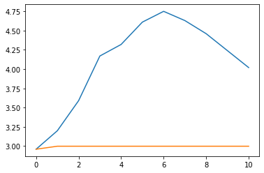

# Battery Discharging


```python
#exports
import numpy as np
import pandas as pd

import seaborn as sns
import matplotlib.pyplot as plt

from sklearn.pipeline import Pipeline
from sklearn.model_selection import KFold
from sklearn.metrics import make_scorer, r2_score, mean_absolute_error, mean_squared_error
from sklearn.linear_model import LinearRegression
from sklearn.ensemble import RandomForestRegressor, GradientBoostingRegressor

from skopt.plots import plot_objective
from skopt.space import Real, Categorical, Integer

from statsmodels.tsa.stattools import acf
from moepy.lowess import Lowess, quantile_model

from batopt import clean, utils

import os
import random
from ipypb import track
import FEAutils as hlp
```

<br>

### User Inputs

```python
raw_data_dir = '../data/raw'
intermediate_data_dir = '../data/intermediate'
cache_data_dir = '../data/nb-cache'
```

<br>

### Preparing Data

We'll start by loading the datasets, we'll interpolate the weather data which is at an hourly granularity 

```python
df = clean.combine_training_datasets(intermediate_data_dir).interpolate(limit=1)

df.head()
```


| ('Unnamed: 0_level_0', 'datetime')   |   ('demand_MW', 'Unnamed: 1_level_1') |   ('irradiance_Wm-2', 'Unnamed: 2_level_1') |   ('panel_temp_C', 'Unnamed: 3_level_1') |   ('pv_power_mw', 'Unnamed: 4_level_1') |   ('solar_location1', 'Unnamed: 5_level_1') |   ('solar_location2', 'Unnamed: 6_level_1') |   ('solar_location3', 'Unnamed: 7_level_1') |   ('solar_location4', 'Unnamed: 8_level_1') |   ('solar_location5', 'Unnamed: 9_level_1') |   ('solar_location6', 'Unnamed: 10_level_1') |   ('temp_location1', 'Unnamed: 11_level_1') |   ('temp_location2', 'Unnamed: 12_level_1') |   ('temp_location3', 'Unnamed: 13_level_1') |   ('temp_location4', 'Unnamed: 14_level_1') |   ('temp_location5', 'Unnamed: 15_level_1') |   ('temp_location6', 'Unnamed: 16_level_1') |
|:-------------------------------------|--------------------------------------:|--------------------------------------------:|-----------------------------------------:|----------------------------------------:|--------------------------------------------:|--------------------------------------------:|--------------------------------------------:|--------------------------------------------:|--------------------------------------------:|---------------------------------------------:|--------------------------------------------:|--------------------------------------------:|--------------------------------------------:|--------------------------------------------:|--------------------------------------------:|--------------------------------------------:|
| 2017-11-03 00:00:00+00:00            |                                  2.19 |                                           0 |                                     7.05 |                                       0 |                                           0 |                                           0 |                                           0 |                                           0 |                                           0 |                                            0 |                                       8.56  |                                       9.64  |                                        7.46 |                                       6.68  |                                      13.09  |                                       13.2  |
| 2017-11-03 00:30:00+00:00            |                                  2.14 |                                           0 |                                     7.38 |                                       0 |                                           0 |                                           0 |                                           0 |                                           0 |                                           0 |                                            0 |                                       8.625 |                                       9.675 |                                        7.3  |                                       6.475 |                                      13.15  |                                       13.26 |
| 2017-11-03 01:00:00+00:00            |                                  2.01 |                                           0 |                                     7.7  |                                       0 |                                           0 |                                           0 |                                           0 |                                           0 |                                           0 |                                            0 |                                       8.69  |                                       9.71  |                                        7.14 |                                       6.27  |                                      13.21  |                                       13.32 |
| 2017-11-03 01:30:00+00:00            |                                  1.87 |                                           0 |                                     7.48 |                                       0 |                                           0 |                                           0 |                                           0 |                                           0 |                                           0 |                                            0 |                                       8.715 |                                       9.72  |                                        7    |                                       6.09  |                                      13.255 |                                       13.34 |
| 2017-11-03 02:00:00+00:00            |                                  1.86 |                                           0 |                                     7.2  |                                       0 |                                           0 |                                           0 |                                           0 |                                           0 |                                           0 |                                            0 |                                       8.74  |                                       9.73  |                                        6.86 |                                       5.91  |                                      13.3   |                                       13.36 |</div>


<br>

### Exploratory Demand Analysis

We'll start by exploring the relationship between time of day and demand, in this instance fitting a quantile LOWESS model to get a probabilistic view of likely loads at specific times of day

```python
#exports
def estimate_daily_demand_quantiles(x, y, x_pred = np.linspace(0, 23.5, 100), **model_kwargs):
    # Fitting the model
    df_quantiles = quantile_model(x, y, x_pred=x_pred, **model_kwargs)

    # Cleaning names and sorting for plotting
    df_quantiles.columns = [f'p{int(col*100)}' for col in df_quantiles.columns]
    df_quantiles = df_quantiles[df_quantiles.columns[::-1]]
    
    return df_quantiles
```

```python
dts = df.index.tz_convert('Europe/London')
x = dts.hour + dts.minute/60
y = df['demand_MW'].values

rerun_daily_demand_model = False
daily_demand_filename = 'daily_demand_quantile_model_results.csv'

if (rerun_daily_demand_model == True) or (daily_demand_filename not in os.listdir(cache_data_dir)):
    df_quantiles = estimate_daily_demand_quantiles(x, y, frac=0.2, num_fits=48, robust_iters=3)
    df_quantiles.to_csv(f'{cache_data_dir}/{daily_demand_filename}')
else:
    df_quantiles = pd.read_csv(f'{cache_data_dir}/{daily_demand_filename}', index_col='x')

df_quantiles.head()
```


|   ('Unnamed: 0_level_0', 'x') |   ('p90', 'Unnamed: 1_level_1') |   ('p80', 'Unnamed: 2_level_1') |   ('p70', 'Unnamed: 3_level_1') |   ('p60', 'Unnamed: 4_level_1') |   ('p50', 'Unnamed: 5_level_1') |   ('p40', 'Unnamed: 6_level_1') |   ('p30', 'Unnamed: 7_level_1') |   ('p20', 'Unnamed: 8_level_1') |   ('p10', 'Unnamed: 9_level_1') |
|------------------------------:|--------------------------------:|--------------------------------:|--------------------------------:|--------------------------------:|--------------------------------:|--------------------------------:|--------------------------------:|--------------------------------:|--------------------------------:|
|                      0        |                         2.79849 |                         2.71229 |                         2.64641 |                         2.56191 |                         2.39701 |                         2.10668 |                         1.88967 |                         1.81977 |                         1.77097 |
|                      0.237374 |                         2.76187 |                         2.67597 |                         2.60871 |                         2.5275  |                         2.3697  |                         2.09069 |                         1.86875 |                         1.79585 |                         1.74577 |
|                      0.474747 |                         2.72532 |                         2.63973 |                         2.57116 |                         2.49312 |                         2.34246 |                         2.0744  |                         1.84797 |                         1.77185 |                         1.72058 |
|                      0.712121 |                         2.68871 |                         2.60348 |                         2.53355 |                         2.45863 |                         2.31533 |                         2.05794 |                         1.82746 |                         1.74759 |                         1.69522 |
|                      0.949495 |                         2.65212 |                         2.56737 |                         2.49614 |                         2.42416 |                         2.28829 |                         2.04086 |                         1.80704 |                         1.72319 |                         1.6696  |</div>


<br>

We'll now visualise these quantile fits alongside the raw data

N.b. the x values have been slightly jittered in order to make their distribution easier to visualise

```python
x_jittered = x + (np.random.uniform(size=len(x)) - 0.5)/2.5

# Plotting
fig, ax = plt.subplots(dpi=250)

ax.scatter(x_jittered, y, s=0.2, color='k', alpha=0.5)
df_quantiles.plot(cmap='viridis', legend=False, ax=ax)

hlp.hide_spines(ax)
ax.legend(frameon=False, bbox_to_anchor=(1, 0.9), title='Percentiles')
ax.set_xlabel('Time of Day')
ax.set_ylabel('Demand (MW)')
ax.set_xlim(0, 24)
ax.set_ylim(1, 6)

fig.savefig('../img/daily_demand_profile.png')
```


<br>

One of the issues with the quantile fit is that it hides the a lot of the spikiness in individual daily profiles, here we'll create a function for randomly sampling days so we can visualise them alongside each other.

```python
#exports
reset_idx_dt = lambda s, dt='2020-01-01': s.index - (s.index[0]-pd.to_datetime(dt, utc=True))

def sample_random_day(s):
    random_dt = random.choice(s.index.date)
    s_sample_dt = s.loc[str(random_dt)]
    
    return s_sample_dt

def sample_random_days(s, num_days=5):
    df_sample_dts = pd.DataFrame()

    for _ in range(num_days):
        s_sample_dt = sample_random_day(s)
        dt = str(s_sample_dt.index[0].date())
        s_sample_dt.index = reset_idx_dt(s_sample_dt)
        df_sample_dts[dt] = s_sample_dt
        
    df_sample_dts = df_sample_dts.sort_index(axis=1)

    return df_sample_dts
```

```python
s_demand = df['demand_MW']
df_sample_dts = sample_random_days(s_demand)
    
# Plotting
fig, ax = plt.subplots(dpi=150)

df_sample_dts.plot(ax=ax)

ax.legend(frameon=False)
hlp.hide_spines(ax)
ax.set_xlabel('')
ax.set_ylabel('Demand (MW)')

_ = plt.setp(ax.get_xmajorticklabels(), visible=False)
```


<br>

We'll also check the auto-correlation of the demand time-series, particularly in regard to the the correlation of the most recent value with the value from one week prior (what will be available for the test data)

```python
acf_array = acf(s_demand, fft=True, nlags=48*7*2)

day_blocks = [0] + list(np.array([[i+1]*48 for i in range(14)]).reshape(-1))
s_acf_days_max = pd.Series(acf_array).groupby(day_blocks).max()
corr_with_last_weeks_SP = s_acf_days_max.loc[7]

# Plotting
fig, ax = plt.subplots()

s_acf_days_max.plot.bar(ax=ax)
ax.plot([-0.5, 14.5], [corr_with_last_weeks_SP, corr_with_last_weeks_SP], 'k--')

ax.set_ylim(0.7, 1)
ax.set_xlabel('Day')
ax.set_ylabel('Correlation')
hlp.hide_spines(ax)
```


```python
# We cant yet do a seasonal decomposition using statsmodels (requires 2 years of data)
# Once it is possible we should though
```

<br>

We'll also fit a quantile model for the relationship between temperature and demand

```python
x = df[df.columns[df.columns.str.contains('temp_location')]].mean(axis=1).values
y = df['demand_MW'].values

rerun_temp_demand_model = False
temp_demand_filename = 'temp_demand_quantile_model_results.csv'

if (rerun_temp_demand_model == True) or (temp_demand_filename not in os.listdir(cache_data_dir)):
    df_quantiles = estimate_daily_demand_quantiles(x, y, frac=0.35, num_fits=48, robust_iters=5)
    df_quantiles.to_csv(f'{cache_data_dir}/{temp_demand_filename}')
else:
    df_quantiles = pd.read_csv(f'{cache_data_dir}/{temp_demand_filename}', index_col='x')

df_quantiles.head()
```


|   ('Unnamed: 0_level_0', 'x') |   ('p90', 'Unnamed: 1_level_1') |   ('p80', 'Unnamed: 2_level_1') |   ('p70', 'Unnamed: 3_level_1') |   ('p60', 'Unnamed: 4_level_1') |   ('p50', 'Unnamed: 5_level_1') |   ('p40', 'Unnamed: 6_level_1') |   ('p30', 'Unnamed: 7_level_1') |   ('p20', 'Unnamed: 8_level_1') |   ('p10', 'Unnamed: 9_level_1') |
|------------------------------:|--------------------------------:|--------------------------------:|--------------------------------:|--------------------------------:|--------------------------------:|--------------------------------:|--------------------------------:|--------------------------------:|--------------------------------:|
|                      0        |                         4.97915 |                         4.54269 |                         4.2198  |                         3.87288 |                         3.37484 |                         2.90171 |                         2.70959 |                         2.59651 |                         2.46055 |
|                      0.237374 |                         4.96727 |                         4.52208 |                         4.20217 |                         3.86098 |                         3.37012 |                         2.89377 |                         2.69721 |                         2.58177 |                         2.44486 |
|                      0.474747 |                         4.95515 |                         4.50144 |                         4.18453 |                         3.84911 |                         3.36556 |                         2.88588 |                         2.685   |                         2.56718 |                         2.42925 |
|                      0.712121 |                         4.94284 |                         4.48071 |                         4.16686 |                         3.83725 |                         3.3611  |                         2.87787 |                         2.67285 |                         2.55265 |                         2.41369 |
|                      0.949495 |                         4.93029 |                         4.45984 |                         4.14914 |                         3.82542 |                         3.35674 |                         2.86969 |                         2.66073 |                         2.53816 |                         2.39816 |</div>


<br>

Which we'll visualise similarly to the daily demand profile

```python
fig, ax = plt.subplots(dpi=250)

ax.scatter(x, y, s=0.2, color='k', alpha=0.5)
df_quantiles.plot(cmap='viridis', legend=False, ax=ax)

hlp.hide_spines(ax)
ax.legend(frameon=False, bbox_to_anchor=(1, 0.25), title='Percentiles')
ax.set_xlabel('Temperature (degC)')
ax.set_ylabel('Demand (MW)')
ax.set_xlim(0, 24)
ax.set_ylim(1, 6)

fig.savefig('../img/temp_demand_profile.png')
```


```python
# ^ Should use daily average (or evening block) instead of each SP
```

<br>

### Strategy Development with Perfect Foresight

Here we'll develop a charging strategy for when we have perfect foresight, starting by sampling a random day from the demand series and then extracting the evening profile as an array from that

```python
#exports
def extract_evening_demand_profile(s_demand_sample_dt, start_time='15:30', end_time='20:30'):
    dt = str(s_demand_sample_dt.index[0].date())
    evening_demand_profile = s_demand_sample_dt[f'{dt} {start_time}':f'{dt} {end_time}'].values

    return evening_demand_profile
```

```python
evening_demand_profile = sample_random_day(s_demand).pipe(extract_evening_demand_profile)

plt.plot(evening_demand_profile)
```


    [<matplotlib.lines.Line2D at 0x280cdb32e80>]


<br>

We'll then write an algorithm for peak flattening

```python
#exports
def flatten_peak(evening_demand_profile, charge=6, time_unit=0.5):
    peak = max(evening_demand_profile)
    adj_evening_demand_profile = evening_demand_profile.copy()

    while charge > 0:
        num_periods_plateaued = (evening_demand_profile>=peak).sum()

        # If the evening demand profile has been fully flattened
        # then split up the remaining charge equally across all SPs
        fully_flattened = len(set(adj_evening_demand_profile)) == 1

        if fully_flattened == True:
            remaining_discharge_rate_for_each_SP = (1/time_unit)*charge/len(adj_evening_demand_profile)
            adj_evening_demand_profile -= remaining_discharge_rate_for_each_SP
            charge = 0
            break

        # If there is still a peak then determine the next highest value 
        else:
            peak = max(adj_evening_demand_profile)
            highest_non_peak = max(adj_evening_demand_profile[peak>adj_evening_demand_profile])

            proposed_additional_discharge = time_unit*(adj_evening_demand_profile.sum() - np.minimum(adj_evening_demand_profile, highest_non_peak).sum())

        # if its possible to reduce the peak to the next highest value do so
        if charge >= proposed_additional_discharge:
            adj_evening_demand_profile = np.minimum(adj_evening_demand_profile, highest_non_peak)
            charge -= proposed_additional_discharge

        # If the capacity constraints are broken when reducing to the next 
        # highest value then just lower the current peak as far as possible
        else:
            new_peak = peak - ((1/time_unit)*charge/(num_periods_plateaued+1))
            adj_evening_demand_profile = np.minimum(adj_evening_demand_profile, new_peak)
            charge = 0

    return adj_evening_demand_profile
```

```python
adj_evening_demand_profile = flatten_peak(evening_demand_profile)

plt.plot(evening_demand_profile)
plt.plot(adj_evening_demand_profile)
```


    [<matplotlib.lines.Line2D at 0x280cdbc07f0>]





<br>

Which we can deduct from the original evening profile to construct the discharge profile

```python
#exports
construct_discharge_profile = lambda evening_demand_profile, adj_evening_demand_profile: -(evening_demand_profile - adj_evening_demand_profile)
```

```python
discharge_profile = construct_discharge_profile(evening_demand_profile, adj_evening_demand_profile)

plt.plot(discharge_profile)
```


    [<matplotlib.lines.Line2D at 0x280cdb56d30>]


<br>

Rather than the sample day we've just used we'll now repeat this step for all days we have demand data on, returning a series of the new discharge values that can be easily added to the charging values

```python
#exports
def construct_discharge_s(s_demand, start_time='15:30', end_time='20:30'):
    s_discharge = pd.Series(index=s_demand.index, dtype=float).fillna(0)

    for dt in s_demand.index.strftime('%Y-%m-%d').unique():
        evening_demand_profile = s_demand[dt].pipe(extract_evening_demand_profile)
        adj_evening_demand_profile = flatten_peak(evening_demand_profile)
        
        discharge_profile = construct_discharge_profile(evening_demand_profile, adj_evening_demand_profile)
        s_discharge[f'{dt} {start_time}':f'{dt} {end_time}'] = discharge_profile

    return s_discharge
```

```python
s_discharge = construct_discharge_s(s_demand, start_time='15:30', end_time='20:30')

s_discharge.iloc[:48*7].plot()
```


    <AxesSubplot:xlabel='datetime'>


<br>

We can also use this discharging profile to see what the new peaks look like

```python
s_demand.iloc[:48*7].plot()
(s_demand+s_discharge).iloc[:48*7].plot()
```


    <AxesSubplot:xlabel='datetime'>


<br>

### Strategy Development under Uncertainty

Our overall approach can be thought of as follows:

1. Generate an optimal discharge profile under perfect foresight
2. Train a regression model to emulate the optimal discharge profile
3. Clean profile to ensure that constraints aren't broken and the full 6 MWh is fully utilised

We've generated our optimal discharge profile, now we're ready to train the model. We'll start by constructing our features dataframe.

```python
#exports
def construct_df_discharge_features(df):
    # Filtering for the temperature weather data
    df_features = df[df.columns[df.columns.str.contains('temp_location')]].copy()
    
    # Adding lagged demand
    df_features['demand_7d_lag'] = df['demand_MW'].shift(48*7)

    # Adding datetime features
    dts = df_features.index.tz_convert('Europe/London') # We want to use the 'behavioural' timezone

    df_features['weekend'] = dts.dayofweek.isin([5, 6]).astype(int)
    df_features['hour'] = dts.hour + dts.minute/60
    df_features['doy'] = dts.dayofyear
    df_features['dow'] = dts.dayofweek
    
    # Removing NaN values
    df_features = df_features.dropna()
    
    return df_features
```

```python
df_features = construct_df_discharge_features(df)

df_features.head()
```


| ('Unnamed: 0_level_0', 'datetime')   |   ('temp_location1', 'Unnamed: 1_level_1') |   ('temp_location2', 'Unnamed: 2_level_1') |   ('temp_location3', 'Unnamed: 3_level_1') |   ('temp_location4', 'Unnamed: 4_level_1') |   ('temp_location5', 'Unnamed: 5_level_1') |   ('temp_location6', 'Unnamed: 6_level_1') |   ('demand_7d_lag', 'Unnamed: 7_level_1') |   ('weekend', 'Unnamed: 8_level_1') |   ('hour', 'Unnamed: 9_level_1') |   ('doy', 'Unnamed: 10_level_1') |   ('dow', 'Unnamed: 11_level_1') |
|:-------------------------------------|-------------------------------------------:|-------------------------------------------:|-------------------------------------------:|-------------------------------------------:|-------------------------------------------:|-------------------------------------------:|------------------------------------------:|------------------------------------:|---------------------------------:|---------------------------------:|---------------------------------:|
| 2017-11-10 00:00:00+00:00            |                                     10.66  |                                      9.48  |                                       9.68 |                                      7.5   |                                      12.75 |                                     12.25  |                                      2.19 |                                   0 |                              0   |                              314 |                                4 |
| 2017-11-10 00:30:00+00:00            |                                     11     |                                      9.865 |                                       9.99 |                                      7.875 |                                      12.91 |                                     12.475 |                                      2.14 |                                   0 |                              0.5 |                              314 |                                4 |
| 2017-11-10 01:00:00+00:00            |                                     11.34  |                                     10.25  |                                      10.3  |                                      8.25  |                                      13.07 |                                     12.7   |                                      2.01 |                                   0 |                              1   |                              314 |                                4 |
| 2017-11-10 01:30:00+00:00            |                                     11.495 |                                     10.68  |                                      10.78 |                                      8.655 |                                      13.09 |                                     12.94  |                                      1.87 |                                   0 |                              1.5 |                              314 |                                4 |
| 2017-11-10 02:00:00+00:00            |                                     11.65  |                                     11.11  |                                      11.26 |                                      9.06  |                                      13.11 |                                     13.18  |                                      1.86 |                                   0 |                              2   |                              314 |                                4 |</div>


<br>

We now need to split up our X and y values, filtering only for those that fall into the evening period

```python
#exports
def extract_evening_datetimes(df):
    hour = df.index.hour + df.index.minute/60
    evening_datetimes = df.index[(20.5>=hour) & (15.5<=hour)]
    
    return evening_datetimes
```

```python
evening_datetimes = extract_evening_datetimes(df_features)

X = df_features.loc[evening_datetimes].values
y = s_discharge.loc[evening_datetimes].values
```

<br>

We'll create a basic prediction using a standard linear model

```python
df_pred = clean.generate_kfold_preds(X, y, LinearRegression(), index=evening_datetimes)

df_pred.head()
```


| ('Unnamed: 0_level_0', 'datetime')   |   ('pred', 'Unnamed: 1_level_1') |   ('true', 'Unnamed: 2_level_1') |
|:-------------------------------------|---------------------------------:|---------------------------------:|
| 2017-11-10 15:30:00+00:00            |                        -0.696409 |                        -0.125455 |
| 2017-11-10 16:00:00+00:00            |                        -0.780102 |                        -0.565455 |
| 2017-11-10 16:30:00+00:00            |                        -0.944032 |                        -1.12546  |
| 2017-11-10 17:00:00+00:00            |                        -1.12002  |                        -1.58546  |
| 2017-11-10 17:30:00+00:00            |                        -1.17005  |                        -1.66545  |</div>


<br>

However, in this approach there's nothing to enforce the battery constraints, namely maximum total discharge and instantaneous discharge rate. This becomes apparant when we visualise the distribution of total discharge volumes each evening.

```python
s_daily_discharge = df_pred['pred'].groupby(df_pred.index.date).sum()

sns.distplot(s_daily_discharge)
```

    C:\Users\Ayrto\anaconda3\envs\batopt\lib\site-packages\seaborn\distributions.py:2557: FutureWarning: `distplot` is a deprecated function and will be removed in a future version. Please adapt your code to use either `displot` (a figure-level function with similar flexibility) or `histplot` (an axes-level function for histograms).
      warnings.warn(msg, FutureWarning)
    


    <AxesSubplot:xlabel='pred', ylabel='Density'>


<br>

To account for this we can normalise each daily discharge profile by the ratio between the current total discharge and the maximum current discharge

```python
#exports
def normalise_total_discharge(s_pred, charge=6, time_unit=0.5):
    s_daily_discharge = s_pred.groupby(s_pred.index.date).sum()

    for date, total_discharge in s_daily_discharge.items():
        s_pred.loc[str(date)] *= -charge/(time_unit*total_discharge)
        
    return s_pred
```

```python
s_daily_discharge = (df_pred
                     ['pred']
                     .pipe(normalise_total_discharge)
                     .groupby(df_pred.index.date)
                     .sum()
                     .round(10)
                    )

s_daily_discharge.value_counts()
```


    -12.0    255
    Name: pred, dtype: int64


<br>

We also need to ensure that the discharge rate remains within the bounds of the problem definition, i.e. no greater than -2.5 MW

```python
#exports
clip_discharge_rate = lambda s_pred, max_rate=-2.5, min_rate=0: s_pred.clip(lower=max_rate, upper=min_rate)
```

```python
s_pred = df_pred['pred'].pipe(clip_discharge_rate)

s_pred.head()
```


    datetime
    2017-11-10 15:30:00+00:00   -0.771329
    2017-11-10 16:00:00+00:00   -0.864027
    2017-11-10 16:30:00+00:00   -1.045592
    2017-11-10 17:00:00+00:00   -1.240513
    2017-11-10 17:30:00+00:00   -1.295929
    Name: pred, dtype: object


<br>

We'll now combine these post prediction processing steps into a single function, ready to use in our model evaluation

```python
#exports
post_pred_proc_func = lambda s_pred: (s_pred
                                      .pipe(normalise_total_discharge)
                                      .pipe(clip_discharge_rate)
                                     )
```

<br>

We'll create a new function that evaluates our discharge profile in terms of the peak reduction achieved relative the reduction using an optimal discharge profile. We'll then use this and our standard mae and rmse metrics to evaluate some different models.

```python
#exports
def construct_peak_reduction_calculator(s_demand, evening_datetimes=None, scorer=False):
    if evening_datetimes is None:
        evening_datetimes = extract_evening_datetimes(s_demand)
            
    def calc_peak_reduction(y, y_pred):
        # Checking evening datetimes
        if hasattr(y_pred, 'index') == True:
            evening_datetimes = extract_evening_datetimes(y_pred)
            
        assert y_pred.shape[0] == s_demand.loc[evening_datetimes].shape[0], f'The prediction series must be the same length as the number of evening datetimes in the main dataframe, {y_pred.shape[0]} {s_demand.loc[evening_datetimes].shape[0]}'

        # Identifying daily peaks
        s_old_peaks = s_demand.loc[evening_datetimes].groupby(evening_datetimes.date).max()
        s_new_peaks = (s_demand.loc[evening_datetimes]+y_pred).groupby(evening_datetimes.date).max()
        s_optimal_peaks = (s_demand.loc[evening_datetimes]+y).groupby(evening_datetimes.date).max()

        # Calculating the peak reduction
        s_new_pct_peak_reduction = 100*(s_old_peaks-s_new_peaks)/s_old_peaks
        s_optimal_pct_peak_reduction = 100*(s_old_peaks-s_optimal_peaks)/s_old_peaks

        # after cleaning anomalous demand data should add an assert to check for non finite values

        pct_of_max_possible_reduction = 100*(s_new_pct_peak_reduction.replace(np.inf, np.nan).dropna().mean()/
                                             s_optimal_pct_peak_reduction.replace(np.inf, np.nan).dropna().mean())

        return pct_of_max_possible_reduction

    if scorer == True:
        return make_scorer(calc_peak_reduction)
    else:
        return calc_peak_reduction

def evaluate_discharge_models(df, models, features_kwargs={}):
    df_features = construct_df_discharge_features(df, **features_kwargs)
    s_discharge = construct_discharge_s(df['demand_MW'], start_time='15:30', end_time='20:30')
    
    evening_datetimes = extract_evening_datetimes(df_features)
    
    X = df_features.loc[evening_datetimes].values
    y = s_discharge.loc[evening_datetimes].values
    
    model_scores = dict()
    peak_reduction_calc = construct_peak_reduction_calculator(s_demand=df['demand_MW'], evening_datetimes=evening_datetimes)
    
    for model_name, model in track(models.items()):
        df_pred = clean.generate_kfold_preds(X, y, model, index=evening_datetimes)
        df_pred['pred'] = post_pred_proc_func(df_pred['pred'])

        model_scores[model_name] = {
            'pct_optimal_reduction': peak_reduction_calc(df_pred['true'], df_pred['pred']),
            'optimal_discharge_mae': mean_absolute_error(df_pred['true'], df_pred['pred']),
            'optimal_discharge_rmse': np.sqrt(mean_squared_error(df_pred['true'], df_pred['pred']))
        }

    df_model_scores = pd.DataFrame(model_scores)
    
    df_model_scores.index.name = 'metric'
    df_model_scores.columns.name = 'model'
    
    return df_model_scores
```

```python
models = {
    'std_linear': LinearRegression(),
    'random_forest': RandomForestRegressor(),
    'boosted': GradientBoostingRegressor()
}

rerun_discharge_opt_model = False
discharge_opt_filename = 'discharge_optimisation_model_results.csv'

if (rerun_discharge_opt_model == True) or (discharge_opt_filename not in os.listdir(cache_data_dir)):
    df_model_scores = evaluate_discharge_models(df, models)
    df_model_scores.to_csv(f'{cache_data_dir}/{discharge_opt_filename}')
else:
    df_model_scores = pd.read_csv(f'{cache_data_dir}/{discharge_opt_filename}', index_col='metric')

df_model_scores
```


| ('Unnamed: 0_level_0', 'metric')   |   ('std_linear', 'Unnamed: 1_level_1') |   ('random_forest', 'Unnamed: 2_level_1') |   ('boosted', 'Unnamed: 3_level_1') |
|:-----------------------------------|---------------------------------------:|------------------------------------------:|------------------------------------:|
| pct_optimal_reduction              |                              79.1372   |                                 87.82     |                           86.5792   |
| optimal_discharge_mae              |                               0.21258  |                                  0.094955 |                            0.106689 |
| optimal_discharge_rmse             |                               0.275607 |                                  0.12661  |                            0.138982 |</div>


<br>

We'll then generate a prediction time-series using the best performing model

```python
rerun_discharge_pred_model = False
discharge_pred_filename = 'discharge_optimisation_model_pred.csv'

if (rerun_discharge_pred_model == True) or (discharge_pred_filename not in os.listdir(cache_data_dir)):
    top_model = df_model_scores.T['pct_optimal_reduction'].idxmax()
    df_pred = clean.generate_kfold_preds(X, y, models[top_model], index=evening_datetimes)
    df_pred['pred'] = post_pred_proc_func(df_pred['pred'])
    df_pred.to_csv(f'{cache_data_dir}/{discharge_pred_filename}')
else:
    df_pred = pd.read_csv(f'{cache_data_dir}/{discharge_pred_filename}')
    df_pred['datetime'] = pd.to_datetime(df_pred['datetime'], utc=True)
    df_pred = df_pred.set_index('datetime')
    
df_pred.head()
```


| ('Unnamed: 0_level_0', 'datetime')   |   ('pred', 'Unnamed: 1_level_1') |   ('true', 'Unnamed: 2_level_1') |
|:-------------------------------------|---------------------------------:|---------------------------------:|
| 2017-11-10 15:30:00+00:00            |                        -0.213378 |                        -0.125455 |
| 2017-11-10 16:00:00+00:00            |                        -0.735541 |                        -0.565455 |
| 2017-11-10 16:30:00+00:00            |                        -1.19438  |                        -1.12546  |
| 2017-11-10 17:00:00+00:00            |                        -1.57704  |                        -1.58546  |
| 2017-11-10 17:30:00+00:00            |                        -1.61426  |                        -1.66545  |</div>


<br>

We'll quickly check the residuals time-series for model-drift

```python
s_residuals = df_pred.diff(1, axis=1).dropna(axis=1).iloc[:, 0]

s_residuals.plot(linewidth=0.3)
```


    <AxesSubplot:xlabel='datetime'>


<br>

As well as the scatter-plot between the true and estimated optimal charging rates

```python
plt.scatter(df_pred['true'], df_pred['pred'], s=1)

plt.xlabel('Obervation')
plt.ylabel('Prediction')
```


    Text(0, 0.5, 'Prediction')


<br>

### Model Tuning

```python
evening_datetimes = extract_evening_datetimes(df_features)
peak_reduction_scorer = construct_peak_reduction_calculator(s_demand=df['demand_MW'], 
                                                            evening_datetimes=evening_datetimes, 
                                                            scorer=True)

X = df_features.loc[evening_datetimes]
y = s_discharge.loc[evening_datetimes]
groups = evening_datetimes.date

pipeline = Pipeline([
    ('pandas_RF', utils.PandasRandomForestRegressor())
])

search_spaces = {
        'pandas_RF__min_samples_leaf': Integer(1, 20, 'uniform'),
        'pandas_RF__criterion': Categorical(['mse', 'mae']),
        'pandas_RF__n_estimators': Integer(200, 2000, 'uniform'),
        'pandas_RF__max_features': Categorical(['auto', 'sqrt']),
        'pandas_RF__max_depth': Integer(10, 110, 'uniform'),
        'pandas_RF__min_samples_split': Integer(2, 10, 'uniform'),
        'pandas_RF__min_samples_leaf': Integer(1, 4, 'uniform'),
        'pandas_RF__bootstrap': Categorical([True, False])
}

opt = utils.BayesSearchCV(
    pipeline,
    search_spaces,
    n_iter=50,
    verbose=0,
    cv=8, # 8 works well for me as that's how many concurrent workers I can use
    scoring=peak_reduction_scorer,
    n_jobs=-1
)

fit_BayesSearchCV = True

if fit_BayesSearchCV == True:
    opt.fit(X, y, groups=groups)

    print(f'validation score: {opt.best_score_}')
    print(f'test score: {opt.score(X, y)}')
    print(f'best params: {opt.best_params_}')

    _ = plot_objective(opt.optimizer_results_[0])
    plt.show()
```


<div><span class="Text-label" style="display:inline-block; overflow:hidden; white-space:nowrap; text-overflow:ellipsis; min-width:0; max-width:15ex; vertical-align:middle; text-align:right"></span>
<progress style="width:60ex" max="1" value="0" class="Progress-main"/></progress>
<span class="Progress-label"><strong>0%</strong></span>
<span class="Iteration-label">0/1</span>
<span class="Time-label">[0<0, 0.00s/it]</span></div>


    ---------------------------------------------------------------------------

    NameError                                 Traceback (most recent call last)

    <ipython-input-41-9df2567e55a1> in <module>
         36 
         37 if fit_BayesSearchCV == True:
    ---> 38     opt.fit(X, y, groups=groups)
         39 
         40     print(f'validation score: {opt.best_score_}')
    

    c:\users\ayrto\desktop\hackathons\wpd-ds-challenge\batopt\utils.py in bayes_search_CV_fit(self, X, y, groups, callback)
        267             n_iter -= n_points
        268 
    --> 269             if eval_callbacks(callbacks, optim_result):
        270                 break
        271         self._optim_results.append(optim_result)
    

    NameError: name 'eval_callbacks' is not defined


```python
# model = RandomForestRegressor()

# df_pred = clean.generate_kfold_preds(X, y, model, index=evening_datetimes)
# peak_reduction_calc = construct_peak_reduction_calculator(s_demand=df['demand_MW'], evening_datetimes=evening_datetimes)
# pct_optimal_reduction = peak_reduction_calc(df_pred['true'], df_pred['pred'])

# pct_optimal_reduction
```

```python
# use TPOT or skopt to tune the model hyper-parameters
# use mlxtend to select the relevant features
```

```python
# could use public holiday data 
# add the ability to use the discharge model in the final pipeline
```

<br>

Finally we'll export the relevant code to our `batopt` module
