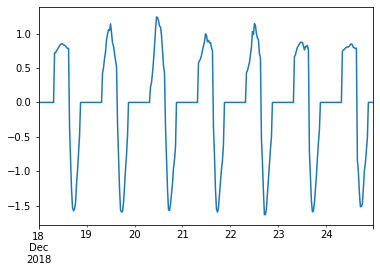
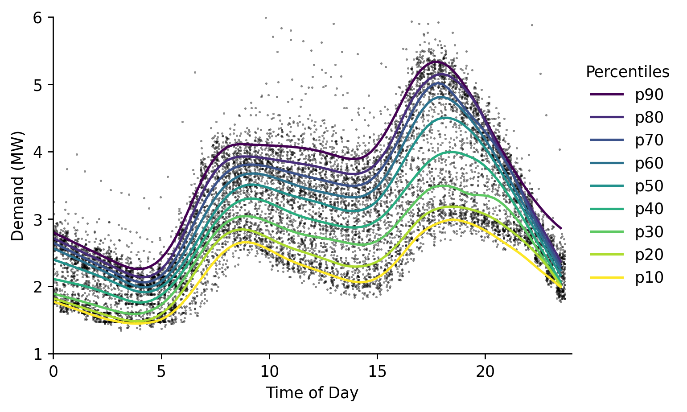
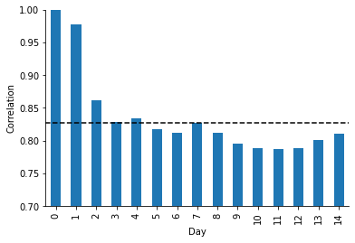
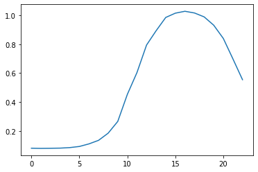

# Battery Charging


### Imports

```python
#exports
import numpy as np
import pandas as pd
import os
import matplotlib.pyplot as plt
import seaborn as sns
import joblib

from moepy.lowess import quantile_model

from sklearn.pipeline import Pipeline
from sklearn.linear_model import LinearRegression
from sklearn.metrics import make_scorer, r2_score, mean_absolute_error, mean_squared_error
from sklearn.ensemble import RandomForestRegressor, GradientBoostingRegressor

from skopt.plots import plot_objective
from skopt.space import Real, Categorical, Integer

from batopt import clean, discharge, utils

import FEAutils as hlp
```

```python
# Should do some investigation of how the panel temp influences performance
```

<br>

### User Stories

```python
raw_data_dir = '../data/raw'
intermediate_data_dir = '../data/intermediate'
cache_data_dir = '../data/nb-cache'
charge_opt_model_fp = '../models/charge_opt.sav'
```

<br>

### Loading Data

```python
df = clean.combine_training_datasets(intermediate_data_dir).interpolate(limit=1)

df.head()
```


|                           |   demand |   pv |   weather |   demand_MW |   irradiance_Wm-2 |   panel_temp_C |   pv_power_mw |   solar_location1 |   solar_location2 |   solar_location3 |   solar_location4 |   solar_location5 |   solar_location6 |   temp_location1 |   temp_location2 |   temp_location3 |   temp_location4 |   temp_location5 |   temp_location6 |   holidays |
|:--------------------------|---------:|-----:|----------:|------------:|------------------:|---------------:|--------------:|------------------:|------------------:|------------------:|------------------:|------------------:|------------------:|-----------------:|-----------------:|-----------------:|-----------------:|-----------------:|-----------------:|-----------:|
| 2015-01-01 00:00:00+00:00 |      nan |  nan |       nan |         nan |               nan |            nan |           nan |                 0 |                 0 |                 0 |                 0 |                 0 |                 0 |             9.75 |            9.65  |            8.83  |            7.58  |           11.62  |            11.22 |        nan |
| 2015-01-01 00:30:00+00:00 |      nan |  nan |       nan |         nan |               nan |            nan |           nan |                 0 |                 0 |                 0 |                 0 |                 0 |                 0 |             9.83 |            9.705 |            8.865 |            7.6   |           11.635 |            11.27 |        nan |
| 2015-01-01 01:00:00+00:00 |      nan |  nan |       nan |         nan |               nan |            nan |           nan |                 0 |                 0 |                 0 |                 0 |                 0 |                 0 |             9.91 |            9.76  |            8.9   |            7.62  |           11.65  |            11.32 |        nan |
| 2015-01-01 01:30:00+00:00 |      nan |  nan |       nan |         nan |               nan |            nan |           nan |                 0 |                 0 |                 0 |                 0 |                 0 |                 0 |             9.95 |            9.78  |            9     |            7.615 |           11.65  |            11.31 |        nan |
| 2015-01-01 02:00:00+00:00 |      nan |  nan |       nan |         nan |               nan |            nan |           nan |                 0 |                 0 |                 0 |                 0 |                 0 |                 0 |             9.99 |            9.8   |            9.1   |            7.61  |           11.65  |            11.3  |        nan |</div>


```python
df.pv_power_mw.plot()
```


    <AxesSubplot:>





<br>

Correlations between the solar variables:

```python
solar_cols = [c for c in df.columns if 'solar_location' in c]
solar_cols.append('irradiance_Wm-2')
solar_cols.append('panel_temp_C')
solar_cols.append('pv_power_mw')

fig, ax = plt.subplots(dpi=250)
df_solar = df.filter(solar_cols).copy()
ax = sns.heatmap(df_solar.corr(), cmap='viridis')
fig.savefig('../img/solar_corrplot.png')
```





<br>

As in the demand data, estimating the quantiles for the solar PV output:

```python
#exports
def estimate_daily_solar_quantiles(x, y, x_pred = np.linspace(0, 23.5, 100), **model_kwargs):
    # Fitting the model
    df_quantiles = quantile_model(x, y, x_pred=x_pred, **model_kwargs)

    # Cleaning names and sorting for plotting
    df_quantiles.columns = [f'p{int(col*100)}' for col in df_quantiles.columns]
    df_quantiles = df_quantiles[df_quantiles.columns[::-1]]
    
    return df_quantiles
```

```python
dts = df.index.tz_convert('Europe/London')
x = np.array(dts.hour + dts.minute/60)
y = df['pv_power_mw'].values

rerun_daily_solar_model = False
daily_solar_filename = 'daily_solar_quantile_model_results.csv'

if (rerun_daily_solar_model == True) or (daily_solar_filename not in os.listdir(cache_data_dir)):
    df_quantiles = estimate_daily_solar_quantiles(x, y, frac=0.2, num_fits=48, robust_iters=3)
    df_quantiles.to_csv(f'{cache_data_dir}/{daily_solar_filename}')
else:
    df_quantiles = pd.read_csv(f'{cache_data_dir}/{daily_solar_filename}', index_col='x')
```

<br>

And plotting

```python
x_jittered = x + (np.random.uniform(size=len(x)) - 0.5)/2.5

# Plotting
fig, ax = plt.subplots(dpi=250)

ax.scatter(x_jittered, y, s=0.2, color='k', alpha=0.5)
df_quantiles.plot(cmap='viridis', legend=False, ax=ax)

hlp.hide_spines(ax)
ax.legend(frameon=False, bbox_to_anchor=(1, 0.9), title='Percentiles')
ax.set_xlabel('Time of Day')
ax.set_ylabel('Demand (MW)')
ax.set_xlim(0, 24)
ax.set_ylim(0, 4)

fig.savefig('../img/daily_solar_profile.png')
```





<br>

### Proportion of days during which we can fully charge the battery

It may be useful to know the proportion of days during which the battery can be fully charged. 

```python
df_solar_hrs = df.between_time('00:00:00', '15:00:00')
pv_generation = df_solar_hrs.groupby(df_solar_hrs.index.date).sum()['pv_power_mw']*0.5 # available daily energy from PV

fig, ax = plt.subplots()
ax.hist(pv_generation, bins=20)
plt.show()

prop = np.sum(pv_generation >= 6)/pv_generation.size
print("Proportion of days where solar generation exceeds 6 MWh: {:.2f}%".format(prop*100))
```


    Proportion of days where solar generation exceeds 6 MWh: 29.85%
    

<br>

### Optimal charging with perfect foresight

We will now develop an algorithm to determine the optimal charging schedule given a perfect solar forecast. 

The scoring function for the generation component rewards us taking as much energy as possible from solar PV. The proportion of energy from PV for a day $d$ is given by $$p_{d,1} = \frac{\sum{P_{d,k}}}{\sum{B_{d,k}}}$$ where we are summing over all periods $k$. An equivalent equation is applies for $p_{d,2}$ which is the energy that is drawn from the grid. The scoring function rewards $p_{d,1}$ over $p_{d,2}$ in a ratio of 3 to 1. 

Any schedule which fully exploits the solar PV potential until the battery is charged is equally good in terms of the scoring function. However, it may be worth considering methods which give a smoother charge profile for the purposes of producing a robust model for unseen days.

In addition, we need to have a method of intelligently allocating charge when the solar PV potential is less than the capacity of the battery.

Some possible methods for this:

- Naively reallocate over the middle of they day (say 09:00--15:00)
- Add charge to periods where charge has already been committed.
- Use a forecast for PV output and allocate charge proportionally to the forecast.

```python
s_pv = df['pv_power_mw'].dropna()
solar_profile = discharge.sample_random_days(s_pv)

solar_profile.plot()
```


    <AxesSubplot:>


<br>

For perfect foresight, any schedule that draws all of the available solar power or 6 MWh (if the total solar production exceeds 6 MWh) is equally good. 

This first approach will aim to draw greedily from  until 6 MWh is satisfied, or all of the solar production has been expended.

In cases where there is not enough solar PV to fill the battery, we will then uniformly add the remaining capacity across all periods.

**Note: this seems to work on this dataset but won't if there is a very large spike in solar PV, such topping up uniformly causes a constraint to be violated. It also may not work if the number of periods over which we top up is decreased.**

```python
#exports
def extract_solar_profile(s_solar_sample_dt, start_time='00:00', end_time='15:00'):
    dt = str(s_solar_sample_dt.index[0].date())
    solar_profile = s_solar_sample_dt[f'{dt} {start_time}':f'{dt} {end_time}'].values

    return solar_profile

def charge_profile_greedy(solar_profile, capacity=6, initial_charge=0, max_charge_rate=2.5, time_unit=0.5):
    order = np.flip(np.argsort(solar_profile))
    charge = initial_charge
    solution = np.zeros(len(solar_profile))
    for i in order:
        solar_available = np.minimum(solar_profile[i], max_charge_rate)
        solar_available = min(solar_available, (capacity - charge)/time_unit) 
        solution[i] = solar_available
        charge = np.sum(solution)*time_unit
        if charge > capacity:
            break
    return solution

def topup_charge_naive(charge_profile, capacity=6, time_unit=0.5, period_start=16, period_end=30):
    charge = np.sum(charge_profile)*time_unit
    spare_cap = capacity - charge
    topup_value = spare_cap/((period_end-period_start)*time_unit)
    new_profile = np.copy(charge_profile)
    new_profile[period_start:period_end] += topup_value # Add topup_value uniformly between start and end periods
    return new_profile

def optimal_charge_profile(solar_profile, capacity=6, time_unit=0.5, max_charge_rate=2.5):
    solution = charge_profile_greedy(solar_profile)
    solution = topup_charge_naive(solution)
    assert np.isclose(np.sum(solution), capacity/time_unit), "Does not meet capacity constraint".format(np.sum(solution)) 
    assert np.all(solution <= max_charge_rate), "Does not meet max charge rate constraint. Max is {}".format(np.max(solution))
    return solution
```

```python
random_solar_profile = discharge.sample_random_day(s_pv).pipe(extract_solar_profile)
x = optimal_charge_profile(random_solar_profile) # Note there is sometimes a rounding error here

plt.plot(x)
```


    [<matplotlib.lines.Line2D at 0x25382e34520>]


<br>

The danger with this method is that it can be quite spiky. I wonder if this (a) makes the function difficult to learn (b) is too risky as compared with hedging bets with a more smoother approach. 

<br>

##### Smooth Approach

We can use the same peak flattening algorithm developed for the dischrge optimisation

```python
adj_random_solar_profile = discharge.flatten_peak(random_solar_profile)

plt.plot(random_solar_profile)
plt.plot(adj_random_solar_profile)
```


    [<matplotlib.lines.Line2D at 0x25382e8f160>]


<br>

Which we can deduct from the original evening profile to construct the charge profile

```python
#exports
construct_charge_profile = lambda solar_profile, adj_solar_profile: solar_profile - adj_solar_profile
```

```python
charge_profile = construct_charge_profile(random_solar_profile, adj_random_solar_profile)

plt.plot(charge_profile)
```


    [<matplotlib.lines.Line2D at 0x25382ed7e80>]


<br>

Rather than the sample day we've just used we'll now repeat this step for all days we have pv data on, returning a series of the new charge values that can be easily added to the discharge values

```python
#exports
def construct_charge_s(s_pv, start_time='00:00', end_time='15:00'):
    s_charge = pd.Series(index=s_pv.index, dtype=float).fillna(0)

    for dt in s_pv.index.strftime('%Y-%m-%d').unique():
        solar_profile = s_pv[dt].pipe(extract_solar_profile, start_time=start_time, end_time=end_time)
        adj_solar_profile = discharge.flatten_peak(solar_profile)
        
        charge_profile = construct_charge_profile(solar_profile, adj_solar_profile)
        
        s_charge[f'{dt} {start_time}':f'{dt} {end_time}'] = charge_profile

    return s_charge

def charge_is_valid(charge_profile, capacity=6, max_charge_rate=2.5, time_unit=0.5):
    """
    Function determining if a charge profile is valid (and fully charges the battery)
    """
    if np.all(np.isclose(capacity/time_unit, charge_profile.groupby(charge_profile.index.date).sum())) is False:
        return False
    elif np.all(charge_profile.groupby(charge_profile.index.date).max() <= max_charge_rate) is False:
        return False
    else:
        return True

```

```python
s_charge = construct_charge_s(s_pv, start_time='00:00', end_time='15:00')

s_charge.iloc[:48*7].plot()

charge_is_valid(s_charge)
```


    True


<br>

With the greedy algorithm we can analyse the periods during which charging occurs:

```python
s_charge.groupby(s_charge.index.time).mean().plot()
```


    <AxesSubplot:xlabel='time'>


<br>

Unsurprisingly we never charge before 5am. We can therefore truncate our training to just look at 05:00--15:30. 

Confirm that the optimal charge adds up to 6 MWh each day: 

```python
s_charge.groupby(s_charge.index.date).sum().round(10).value_counts()
```


    12.000000    763
    12.130526      1
    12.160000      1
    12.118333      1
    12.211000      1
    12.240000      1
    12.095714      1
    12.469091      1
    12.081538      1
    12.555455      1
    12.132308      1
    12.235714      1
    12.003333      1
    12.007100      1
    dtype: int64


<br>

### Model development: charging

Following the same structure as battery discharge, we will aim to predict the optimal charge schedule. 

```python
#exports 
def construct_df_charge_features(df, dt_rng=None):
    if dt_rng is None:
        dt_rng = pd.date_range(df.index.min(), df.index.max(), freq='30T')
        
    df_features = pd.DataFrame(index=dt_rng)
    
    # Filtering for the temperature weather data
    temp_loc_cols = df.columns[df.columns.str.contains('temp_location')]
    df_features.loc[df.index, temp_loc_cols] = df[temp_loc_cols].copy()
    df_features = df_features.ffill(limit=1)
    
    # Adding lagged solar
    df_features['pv_7d_lag'] = df['pv_power_mw'].shift(48*7)
    
    # Adding solar irradiance data
    solar_loc_cols = df.columns[df.columns.str.contains('solar_location')]
    df_features.loc[df.index, solar_loc_cols] = df[solar_loc_cols].copy()
    df_features = df_features.ffill(limit=1)

    # Adding datetime features
    dts = df_features.index.tz_convert('Europe/London') # We want to use the 'behavioural' timezone

    df_features['weekend'] = dts.dayofweek.isin([5, 6]).astype(int)
    df_features['dow'] = dts.dayofweek

    hour = dts.hour + dts.minute/60
    df_features['sin_hour'] = np.sin(2*np.pi*hour/24)
    df_features['cos_hour'] = np.cos(2*np.pi*hour/24)
    
    df_features['sin_doy'] = np.sin(2*np.pi*dts.dayofyear/365)
    df_features['cos_doy'] = np.cos(2*np.pi*dts.dayofyear/365)
    
    # Removing some extraneous features
    cols = [c for c in df_features.columns if 'solar_location4' not in c and 'solar_location1' not in c]
    df_features = df_features.filter(cols)
    
    # Add rolling solar
    solar_cols = [c for c in df_features.columns if 'solar_location' in c]
    df_features[[col+'_rolling' for col in solar_cols]] = df_features.rolling(3).mean()[solar_cols]
    
    # Add rolling temp
    temp_cols = [c for c in df_features.columns if 'temp_location' in c]
    df_features[[col+'_rolling' for col in temp_cols]] = df_features.rolling(3).mean()[temp_cols]
    
    # Removing NaN values
    df_features = df_features.dropna()
    
    return df_features

#exports
def extract_charging_datetimes(df, start_hour=4, end_hour=15):
    hour = df.index.hour + df.index.minute/60
    charging_datetimes = df.index[(hour>=start_hour) & (hour<=end_hour)]
    
    return charging_datetimes
```

```python
#exports
def prepare_training_input_data(intermediate_data_dir, start_hour=4):
    # Loading input data
    df = clean.combine_training_datasets(intermediate_data_dir).interpolate(limit=1)
    df_features = construct_df_charge_features(df)
    
    # Filtering for overlapping feature and target data
    dt_idx = pd.date_range(df_features.index.min(), df['pv_power_mw'].dropna().index.max()-pd.Timedelta(minutes=30), freq='30T')

    s_pv = df.loc[dt_idx, 'pv_power_mw']
    print(s_pv)
    df_features = df_features.loc[dt_idx]
    
    # Constructing the charge series
    s_charge = construct_charge_s(s_pv, start_time=f'0{start_hour}:00', end_time='15:00')
    
    # Filtering for evening datetimes
    charging_datetimes = extract_charging_datetimes(df_features, start_hour=start_hour)
    
    X = df_features.loc[charging_datetimes]
    y = s_charge.loc[charging_datetimes]
    
    return X, y
```

```python
X, y = prepare_training_input_data(intermediate_data_dir)

X.shape, y.shape
```

    2017-11-10 00:00:00+00:00    0.0
    2017-11-10 00:30:00+00:00    0.0
    2017-11-10 01:00:00+00:00    0.0
    2017-11-10 01:30:00+00:00    0.0
    2017-11-10 02:00:00+00:00    0.0
                                ... 
    2019-12-17 21:30:00+00:00    0.0
    2019-12-17 22:00:00+00:00    0.0
    2019-12-17 22:30:00+00:00    0.0
    2019-12-17 23:00:00+00:00    0.0
    2019-12-17 23:30:00+00:00    0.0
    Freq: 30T, Name: pv_power_mw, Length: 36864, dtype: float64
    


    ((17664, 27), (17664,))


```python
random_day = pd.to_datetime(np.random.choice(y.index.date))
plt.plot(y[y.index.date == random_day])
```


    [<matplotlib.lines.Line2D at 0x25382f4b220>]


```python
df_pred = clean.generate_kfold_preds(X.values, y.values, RandomForestRegressor(), index=X.index)

df_pred.head()
```


|                           |     pred |   true |
|:--------------------------|---------:|-------:|
| 2017-11-10 04:00:00+00:00 | 0.066136 |      0 |
| 2017-11-10 04:30:00+00:00 | 0.064022 |      0 |
| 2017-11-10 05:00:00+00:00 | 0.099278 |      0 |
| 2017-11-10 05:30:00+00:00 | 0.031904 |      0 |
| 2017-11-10 06:00:00+00:00 | 0.133574 |      0 |</div>


```python
plt.scatter(df_pred.true, df_pred.pred, s=0.1)
plt.ylabel("Predicted")
plt.xlabel("Actual")
```


    Text(0.5, 0, 'Actual')


<br>

We need to fix the predictions such that they satisfy the battery constraints. We will do this in the same way as applied in the battery discharge component, first clipping the charge rate to be between 0--2.5MW, then normalising such that the total charge sums to 6 MWh.

```python
#exports
def normalise_total_charge(s_pred, charge=6., time_unit=0.5):
    s_daily_charge = s_pred.groupby(s_pred.index.date).sum()

    for date, total_charge in s_daily_charge.items():
        with np.errstate(divide='ignore', invalid='ignore'):
            s_pred.loc[str(date)] *= charge/(time_unit*total_charge)
        
    return s_pred    

clip_charge_rate = lambda s_pred, max_rate=2.5, min_rate=0: s_pred.clip(lower=min_rate, upper=max_rate)

post_pred_charge_proc_func = lambda s_pred: (s_pred
                                      .pipe(clip_charge_rate)
                                      .pipe(normalise_total_charge)
                                     )

```

```python
post_pred_charge_proc_func(df_pred['true']).groupby(df_pred.index.date).sum().value_counts()
```


    12.0    393
    12.0    157
    12.0    138
    12.0     40
    12.0     31
    12.0      4
    12.0      4
    12.0      1
    Name: true, dtype: int64


<br>

### Model Comparison Metrics

Schedules are scored according to the proportion of the total battery charge that comes from solar: $p_{d,1} = \frac{\sum{P_{d,k}}}{\sum{B_{d,k}}}$.

We will first write a function which evaluates this scoring function for a charging schedule and solar profile. 

```python
#exports
def score_charging(schedule, solar_profile):
    # The actual pv charge is the minimum of the scheduled charge and the actual solar availability 
    actual_pv_charge = np.minimum(schedule, solar_profile) 
    score = np.sum(actual_pv_charge)/np.sum(schedule)
    return score
```

```python
# example: 
df_pred['pred'] = post_pred_charge_proc_func(df_pred['pred'])
schedule = discharge.sample_random_day(df_pred['pred'])
solar_profile = df.loc[schedule.index]['pv_power_mw']

print("Score for random day: {}".format(score_charging(schedule, solar_profile)))

# example: 
schedule = df_pred['pred']
solar_profile = df.loc[schedule.index]['pv_power_mw']
print("Score for entire dataset: {}".format(score_charging(schedule, solar_profile)))
```

    Score for random day: 0.6541809834766956
    Score for entire dataset: 0.8135381339249057
    

<br>

**However** remember that some days there is not enough solar PV to fill the battery. It would be good to know what % of the max score we achieved. That is, the sum of our PV charge over the total available PV capacity (capped at 6 MWh per day). 

```python
#exports
def max_available_solar(solar_profile, max_charge_rate=2.5, capacity_mwh=6, time_unit=0.5):
    """
    Return the solar PV potential available to the battery.
    
    That is, the total PV potential with a daily cap of 6 MWh. 
    """
    available = solar_profile.clip(0,2.5).groupby(solar_profile.index.date).sum() * time_unit
    clipped = np.clip(available.values, 0, capacity_mwh)
    total = np.sum(clipped)
    return total   
```

<br>

Now we need a function to evaluate a schedule as a proportion of the max available score. That is, the total PV charge used by the battery divided by the total available solar PV. 

```python
#exports
def prop_max_solar(schedule, solar_profile, time_unit=0.5):
    """
    Get the proportion of maximum solar exploitation for charging schedule, given a solar PV profile
    """
    actual_pv_charge = np.sum(np.minimum(schedule, solar_profile)*time_unit)
    max_pv_charge = max_available_solar(solar_profile)
    return actual_pv_charge/max_pv_charge

def construct_solar_exploit_calculator(solar_profile, charging_datetimes=None, scorer=False):
    if charging_datetimes is None:
        charging_datetimes = extract_charging_datetimes(solar_profile)
            
    def calc_solar_exploitation(y, y_pred):
        # Checking evening datetimes
        if hasattr(y_pred, 'index') == True:
            charging_datetimes = extract_charging_datetimes(y_pred)
            
        assert y_pred.shape[0] == solar_profile.loc[charging_datetimes].shape[0], f'The prediction series must be the same length as the number of evening datetimes in the main dataframe, {y_pred.shape[0]} {s_demand.loc[evening_datetimes].shape[0]}'
        
        exploitation_pct = 100 * prop_max_solar(y_pred, solar_profile.loc[charging_datetimes])

        return exploitation_pct

    if scorer == True:
        return make_scorer(calc_solar_exploitation)
    else:
        return calc_solar_exploitation
```

```python
# example: 
df_pred['pred'] = post_pred_charge_proc_func(df_pred['pred'])
schedule = discharge.sample_random_day(df_pred['pred'])
solar_profile = df.loc[schedule.index]['pv_power_mw']
print("Solar exploitation for random day: {}".format(prop_max_solar(schedule, solar_profile)))

# example: 
schedule = df_pred['pred']
solar_profile = df.loc[schedule.index]['pv_power_mw']
print("Solar exploitation for entire dataset: {}".format(prop_max_solar(schedule, solar_profile)))
```

    Solar exploitation for random day: 0.9995421307529543
    Solar exploitation for entire dataset: 0.9570752322597926
    

<br>

### Model comparison

Now let's try some different models and view their scores and the proportion of maximum PV potential:

```python
models = {
    'std_linear': LinearRegression(),
    'boosted': GradientBoostingRegressor(),
    'random_forest': RandomForestRegressor(),
}

charging_datetimes = extract_charging_datetimes(X)

solar_exploit_calc = construct_solar_exploit_calculator(df['pv_power_mw'], charging_datetimes)

for key in models:
    df_pred = clean.generate_kfold_preds(X.values, y.values, models[key], index=X.index)
    df_pred['pred'] = post_pred_charge_proc_func(df_pred['pred'])
    schedule = df_pred['pred']
    solar_profile = df.loc[schedule.index]['pv_power_mw']
    score = score_charging(schedule, solar_profile)
    
    exploitation_pct = solar_exploit_calc(df_pred['true'], df_pred['pred'])
    
    print(f"Model: `{key}`    Score: {score:.3f}     Proportion of max: {exploitation_pct:.3f}%")
```

    Model: `std_linear`    Score: 0.788     Proportion of max: 92.685%
    Model: `boosted`    Score: 0.797     Proportion of max: 93.818%
    Model: `random_forest`    Score: 0.814     Proportion of max: 95.769%
    

<br>

Final check that the predictions meet the constraints:

```python
print(df_pred['pred'].groupby(df_pred.index.date).sum().value_counts()) # Should sum to 12 MWh for all days
print(np.max(df_pred['pred'])) # Max should not exceed 2.5 MW
```

    12.0    282
    12.0    179
    12.0    171
    12.0     74
    12.0     43
    12.0     12
    12.0      7
    Name: pred, dtype: int64
    1.8012238069778999
    

<br>

Checking out the average day:

```python
average_day = df_pred.pred.astype('float').groupby(df_pred.index.time).mean().values
plt.plot(average_day)
```


    [<matplotlib.lines.Line2D at 0x25383639640>]





<br>

We'll also create a wrapper for fitting and saving the model

```python
#exports
def fit_and_save_charging_model(X, y, charge_opt_model_fp, model_class=RandomForestRegressor, **model_params):
    model = model_class(**model_params)
    model.fit(X, y)
    
    with open(charge_opt_model_fp, 'wb') as fp:
        joblib.dump(model, fp)
        
    return
```

<br>

### Held out set

We'll test this on a hold-out set

```python
def get_train_test(arr, start_of_test_period): 
    train_arr = arr[:pd.to_datetime(start_of_test_period, utc=True)]
    test_arr = arr[pd.to_datetime(start_of_test_period, utc=True):]
    
    return train_arr, test_arr

start_of_test_period = '2019-02-04'

X_train, X_test = get_train_test(X, start_of_test_period)
y_train, y_test = get_train_test(y, start_of_test_period)
```

```python
best_model = LinearRegression()
best_model.fit(X_train, y_train)
preds = pd.Series(best_model.predict(X_test), index=X_test.index)

print(prop_max_solar(preds, y_test))
```

    0.7155203185335218
    

<br>

### Hyperparameter Tuning

We're now ready to tune the hyper-parameters

```python
X, y = prepare_training_input_data(intermediate_data_dir)

charging_datetimes = extract_charging_datetimes(X)
solar_exploit_scorer = construct_solar_exploit_calculator(solar_profile=df['pv_power_mw'], 
                                                            charging_datetimes=charging_datetimes, 
                                                            scorer=True)
groups = charging_datetimes.date

pipeline = Pipeline([
    ('pandas_RF', utils.PandasRandomForestRegressor())
])

search_spaces = {
        'pandas_RF__min_samples_leaf': Integer(1, 20, 'uniform'),
        'pandas_RF__criterion': Categorical(['mse', 'mae']),
        'pandas_RF__n_estimators': Integer(10, 150, 'uniform'),
        'pandas_RF__max_features': Categorical(['auto', 'sqrt']),
        'pandas_RF__max_depth': Integer(5, 200, 'uniform'),
        'pandas_RF__min_samples_split': Integer(2, 10, 'uniform'),
        'pandas_RF__min_samples_leaf': Integer(1, 4, 'uniform'),
        'pandas_RF__bootstrap': Categorical([True, False])
}

opt = utils.BayesSearchCV(
    pipeline,
    search_spaces,
    n_iter=20,
    verbose=1,
    cv=4, # 8 works well for me as that's how many concurrent workers I can use
    scoring=solar_exploit_scorer,
    n_jobs=-1
)

fit_BayesSearchCV = False

if fit_BayesSearchCV == True:
    opt.fit(X, y, groups=groups)

    print(f'validation score: {opt.best_score_}')
    print(f'test score: {opt.score(X, y)}')
    print(f'best params: {opt.best_params_}')

    _ = plot_objective(opt.optimizer_results_[0])
    plt.show()
```

    2017-11-10 00:00:00+00:00    0.0
    2017-11-10 00:30:00+00:00    0.0
    2017-11-10 01:00:00+00:00    0.0
    2017-11-10 01:30:00+00:00    0.0
    2017-11-10 02:00:00+00:00    0.0
                                ... 
    2019-12-17 21:30:00+00:00    0.0
    2019-12-17 22:00:00+00:00    0.0
    2019-12-17 22:30:00+00:00    0.0
    2019-12-17 23:00:00+00:00    0.0
    2019-12-17 23:30:00+00:00    0.0
    Freq: 30T, Name: pv_power_mw, Length: 36864, dtype: float64
    

<br>

We'll now use the tuned values to fit our model

```python
model_params = {
    'criterion': 'mse',
    'min_samples_leaf': 4,
    'min_samples_split': 2,
    'n_estimators': 100,
}
    
model = RandomForestRegressor(**model_params)
df_pred = clean.generate_kfold_preds(X.values, y.values, model, index=X.index)
df_pred['pred'] = post_pred_charge_proc_func(df_pred['pred'])
schedule = df_pred['pred']
solar_profile = df.loc[schedule.index]['pv_power_mw']
exploitation_pct = solar_exploit_calc(df_pred['true'], df_pred['pred'])

print(exploitation_pct)
```

    95.50297361291675
    

<br>

We'll quickly check the residuals

```python
fig, ax = plt.subplots()
ax.scatter(df_pred.true, df_pred.pred, s=0.1)
plt.show()
```


<br>

### Test evaluation

```python
#exports
def prepare_test_feature_data(raw_data_dir, intermediate_data_dir, test_start_date=None, test_end_date=None, start_time='08:00', end_time='23:59'):
    # Loading input data
    df_features = (clean
                   .combine_training_datasets(intermediate_data_dir)
                   .interpolate(limit=1)
                   .pipe(construct_df_charge_features)
                  )
    
    # Loading default index (latest submission)
    if test_end_date is None or test_start_date is None:
        index = discharge.load_latest_submission_template(raw_data_dir).index
    else:
        index = df_features[test_start_date:test_end_date].index
    
    # Filtering feature data on submission datetimes
    df_features = df_features.loc[index].between_time(start_time, end_time)
    
    return df_features
```

```python
df_submission_template = discharge.load_latest_submission_template(raw_data_dir)
df_features = prepare_test_feature_data(raw_data_dir, intermediate_data_dir)

df_features.head()
```


    ---------------------------------------------------------------------------

    KeyError                                  Traceback (most recent call last)

    <ipython-input-45-d1a30d3ccf60> in <module>
          1 df_submission_template = discharge.load_latest_submission_template(raw_data_dir)
    ----> 2 df_features = prepare_test_feature_data(raw_data_dir, intermediate_data_dir)
          3 
          4 df_features.head()
    

    <ipython-input-44-e0ab5bc5a9db> in prepare_test_feature_data(raw_data_dir, intermediate_data_dir, test_start_date, test_end_date, start_time, end_time)
         15 
         16     # Filtering feature data on submission datetimes
    ---> 17     df_features = df_features.loc[index].between_time(start_time, end_time)
         18 
         19     return df_features
    

    ~\anaconda3\envs\batopt\lib\site-packages\pandas\core\indexing.py in __getitem__(self, key)
        892 
        893             maybe_callable = com.apply_if_callable(key, self.obj)
    --> 894             return self._getitem_axis(maybe_callable, axis=axis)
        895 
        896     def _is_scalar_access(self, key: Tuple):
    

    ~\anaconda3\envs\batopt\lib\site-packages\pandas\core\indexing.py in _getitem_axis(self, key, axis)
       1110                     raise ValueError("Cannot index with multidimensional key")
       1111 
    -> 1112                 return self._getitem_iterable(key, axis=axis)
       1113 
       1114             # nested tuple slicing
    

    ~\anaconda3\envs\batopt\lib\site-packages\pandas\core\indexing.py in _getitem_iterable(self, key, axis)
       1050 
       1051         # A collection of keys
    -> 1052         keyarr, indexer = self._get_listlike_indexer(key, axis, raise_missing=False)
       1053         return self.obj._reindex_with_indexers(
       1054             {axis: [keyarr, indexer]}, copy=True, allow_dups=True
    

    ~\anaconda3\envs\batopt\lib\site-packages\pandas\core\indexing.py in _get_listlike_indexer(self, key, axis, raise_missing)
       1263             keyarr, indexer, new_indexer = ax._reindex_non_unique(keyarr)
       1264 
    -> 1265         self._validate_read_indexer(keyarr, indexer, axis, raise_missing=raise_missing)
       1266         return keyarr, indexer
       1267 
    

    ~\anaconda3\envs\batopt\lib\site-packages\pandas\core\indexing.py in _validate_read_indexer(self, key, indexer, axis, raise_missing)
       1305             if missing == len(indexer):
       1306                 axis_name = self.obj._get_axis_name(axis)
    -> 1307                 raise KeyError(f"None of [{key}] are in the [{axis_name}]")
       1308 
       1309             ax = self.obj._get_axis(axis)
    

    KeyError: "None of [DatetimeIndex(['2020-07-03 00:00:00+00:00', '2020-07-03 00:30:00+00:00',\n               '2020-07-03 01:00:00+00:00', '2020-07-03 01:30:00+00:00',\n               '2020-07-03 02:00:00+00:00', '2020-07-03 02:30:00+00:00',\n               '2020-07-03 03:00:00+00:00', '2020-07-03 03:30:00+00:00',\n               '2020-07-03 04:00:00+00:00', '2020-07-03 04:30:00+00:00',\n               ...\n               '2020-07-09 19:00:00+00:00', '2020-07-09 19:30:00+00:00',\n               '2020-07-09 20:00:00+00:00', '2020-07-09 20:30:00+00:00',\n               '2020-07-09 21:00:00+00:00', '2020-07-09 21:30:00+00:00',\n               '2020-07-09 22:00:00+00:00', '2020-07-09 22:30:00+00:00',\n               '2020-07-09 23:00:00+00:00', '2020-07-09 23:30:00+00:00'],\n              dtype='datetime64[ns, UTC]', name='datetime', length=336, freq=None)] are in the [index]"


```python
#exports
def optimise_test_charge_profile(raw_data_dir, intermediate_data_dir, charge_opt_model_fp, test_start_date=None, test_end_date=None, start_time='08:00', end_time='23:59'):
    df_features = prepare_test_feature_data(raw_data_dir, intermediate_data_dir, test_start_date=test_start_date, test_end_date=test_end_date, start_time=start_time, end_time=end_time)
    charging_datetimes = extract_charging_datetimes(df_features)
    X_test = df_features.loc[charging_datetimes].values
    
    model = discharge.load_trained_model(charge_opt_model_fp)
    charge_profile = model.predict(X_test) 
    
    s_charge_profile = pd.Series(charge_profile, index=charging_datetimes)
    s_charge_profile = s_charge_profile.reindex(df_features.index).fillna(0)
    s_charge_profile = post_pred_charge_proc_func(s_charge_profile)
    
    assert charge_is_valid(s_charge_profile), "Charging profile is invalid"
    
    return s_charge_profile
```

```python
s_charge_profile = optimise_test_charge_profile(raw_data_dir, intermediate_data_dir, charge_opt_model_fp)
print(f"Charge is valid: {charge_is_valid(s_charge_profile)}")

s_charge_profile.plot()
```

<br>

Finally we'll export the relevant code to our `batopt` module
