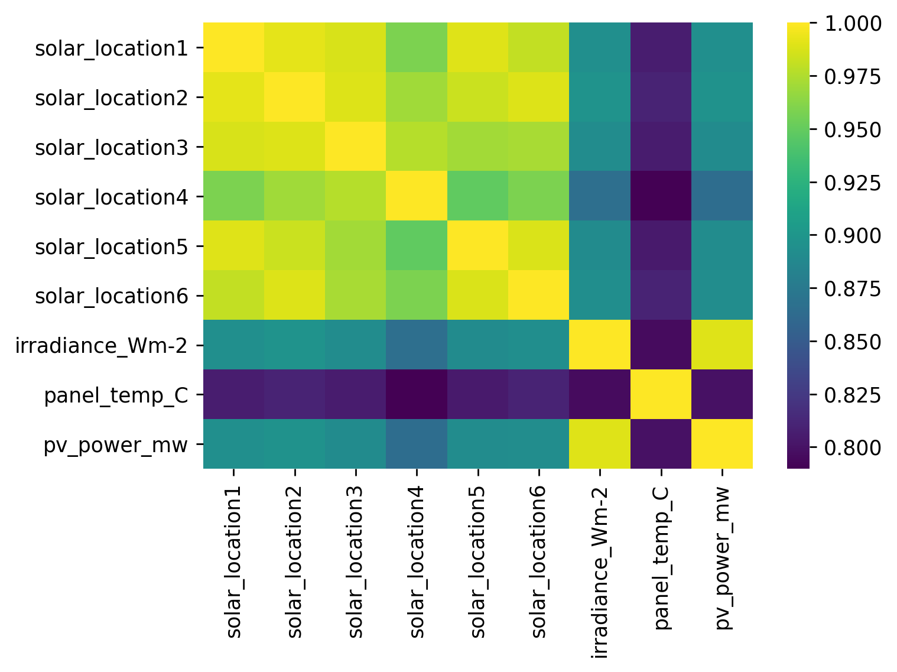
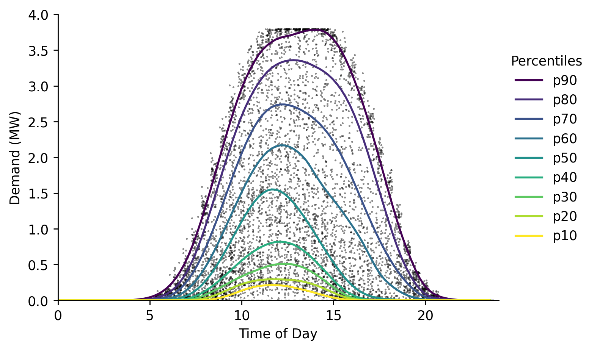
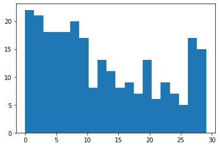

# PV Forecasting


### Imports

```python
#exports
import numpy as np
import pandas as pd
import os
import matplotlib.pyplot as plt
import seaborn as sns

from moepy.lowess import quantile_model

from batopt import clean
from batopt.discharge import sample_random_day

import FEAutils as hlp
```

```python
# Should do some investigation of how the panel temp influences performance
```

```python
raw_data_dir = '../data/raw'
intermediate_data_dir = '../data/intermediate'
cache_data_dir = '../data/nb-cache'
```

```python
df = clean.combine_training_datasets(intermediate_data_dir).interpolate(limit=1)

df.head()
```


| ('Unnamed: 0_level_0', 'datetime')   |   ('demand_MW', 'Unnamed: 1_level_1') |   ('irradiance_Wm-2', 'Unnamed: 2_level_1') |   ('panel_temp_C', 'Unnamed: 3_level_1') |   ('pv_power_mw', 'Unnamed: 4_level_1') |   ('solar_location1', 'Unnamed: 5_level_1') |   ('solar_location2', 'Unnamed: 6_level_1') |   ('solar_location3', 'Unnamed: 7_level_1') |   ('solar_location4', 'Unnamed: 8_level_1') |   ('solar_location5', 'Unnamed: 9_level_1') |   ('solar_location6', 'Unnamed: 10_level_1') |   ('temp_location1', 'Unnamed: 11_level_1') |   ('temp_location2', 'Unnamed: 12_level_1') |   ('temp_location3', 'Unnamed: 13_level_1') |   ('temp_location4', 'Unnamed: 14_level_1') |   ('temp_location5', 'Unnamed: 15_level_1') |   ('temp_location6', 'Unnamed: 16_level_1') |
|:-------------------------------------|--------------------------------------:|--------------------------------------------:|-----------------------------------------:|----------------------------------------:|--------------------------------------------:|--------------------------------------------:|--------------------------------------------:|--------------------------------------------:|--------------------------------------------:|---------------------------------------------:|--------------------------------------------:|--------------------------------------------:|--------------------------------------------:|--------------------------------------------:|--------------------------------------------:|--------------------------------------------:|
| 2017-11-03 00:00:00+00:00            |                                  2.19 |                                           0 |                                     7.05 |                                       0 |                                           0 |                                           0 |                                           0 |                                           0 |                                           0 |                                            0 |                                       8.56  |                                       9.64  |                                        7.46 |                                       6.68  |                                      13.09  |                                       13.2  |
| 2017-11-03 00:30:00+00:00            |                                  2.14 |                                           0 |                                     7.38 |                                       0 |                                           0 |                                           0 |                                           0 |                                           0 |                                           0 |                                            0 |                                       8.625 |                                       9.675 |                                        7.3  |                                       6.475 |                                      13.15  |                                       13.26 |
| 2017-11-03 01:00:00+00:00            |                                  2.01 |                                           0 |                                     7.7  |                                       0 |                                           0 |                                           0 |                                           0 |                                           0 |                                           0 |                                            0 |                                       8.69  |                                       9.71  |                                        7.14 |                                       6.27  |                                      13.21  |                                       13.32 |
| 2017-11-03 01:30:00+00:00            |                                  1.87 |                                           0 |                                     7.48 |                                       0 |                                           0 |                                           0 |                                           0 |                                           0 |                                           0 |                                            0 |                                       8.715 |                                       9.72  |                                        7    |                                       6.09  |                                      13.255 |                                       13.34 |
| 2017-11-03 02:00:00+00:00            |                                  1.86 |                                           0 |                                     7.2  |                                       0 |                                           0 |                                           0 |                                           0 |                                           0 |                                           0 |                                            0 |                                       8.74  |                                       9.73  |                                        6.86 |                                       5.91  |                                      13.3   |                                       13.36 |</div>


Correlations between the solar variables:

```python
solar_cols = [c for c in df.columns if 'solar_location' in c]
solar_cols.append('irradiance_Wm-2')
solar_cols.append('panel_temp_C')
solar_cols.append('pv_power_mw')

fig, ax = plt.subplots(dpi=250)
df_solar = df.filter(solar_cols).copy()
ax = sns.heatmap(df_solar.corr(), cmap='viridis')
fig.savefig('../img/solar_corrplot.png')
```





As in the demand data, estimating the quantiles for the solar PV output:

```python
#exports
def estimate_daily_solar_quantiles(x, y, x_pred = np.linspace(0, 23.5, 100), **model_kwargs):
    # Fitting the model
    df_quantiles = quantile_model(x, y, x_pred=x_pred, **model_kwargs)

    # Cleaning names and sorting for plotting
    df_quantiles.columns = [f'p{int(col*100)}' for col in df_quantiles.columns]
    df_quantiles = df_quantiles[df_quantiles.columns[::-1]]
    
    return df_quantiles

dts = df.index.tz_convert('Europe/London')
x = np.array(dts.hour + dts.minute/60)
y = df['pv_power_mw'].values

rerun_daily_solar_model = False
daily_solar_filename = 'daily_solar_quantile_model_results.csv'

if (rerun_daily_solar_model == True) or (daily_solar_filename not in os.listdir(cache_data_dir)):
    df_quantiles = estimate_daily_solar_quantiles(x, y, frac=0.2, num_fits=48, robust_iters=3)
    df_quantiles.to_csv(f'{cache_data_dir}/{daily_solar_filename}')
else:
    df_quantiles = pd.read_csv(f'{cache_data_dir}/{daily_demand_filename}', index_col='x')
```

And plotting

```python
x_jittered = x + (np.random.uniform(size=len(x)) - 0.5)/2.5

# Plotting
fig, ax = plt.subplots(dpi=250)

ax.scatter(x_jittered, y, s=0.2, color='k', alpha=0.5)
df_quantiles.plot(cmap='viridis', legend=False, ax=ax)

hlp.hide_spines(ax)
ax.legend(frameon=False, bbox_to_anchor=(1, 0.9), title='Percentiles')
ax.set_xlabel('Time of Day')
ax.set_ylabel('Demand (MW)')
ax.set_xlim(0, 24)
ax.set_ylim(0, 4)

fig.savefig('../img/daily_solar_profile.png')
```





## Proportion of days during which we can fully charge the battery

It may be useful to know the proportion of days during which the battery can be fully charged. 

```python
df_solar_hrs = df.between_time('00:00:00', '15:00:00')
pv_generation = df_solar_hrs.groupby(df_solar_hrs.index.date).sum()['pv_power_mw']*0.5 # available daily energy from PV

fig, ax = plt.subplots()
ax.hist(pv_generation, bins=20)
plt.show()

prop = np.sum(pv_capacity >= 6)/pv_capacity.size
print("Proportion of days where solar generation exceeds 6 MWh: {:.2f}%".format(prop*100))
```





    Proportion of days where solar generation exceeds 6 MWh: 69.08%
    

## Optimal charging with perfect foresight

We will now develop an algorithm to determine the optimal charging schedule given a perfect solar forecast. 

```python
#exports
def extract_solar_profile(s_solar_sample_dt, start_time='00:00', end_time='15:00'):
    dt = str(s_solar_sample_dt.index[0].date())
    solar_profile = s_solar_sample_dt[f'{dt} {start_time}':f'{dt} {end_time}'].values

    return solar_profile
```

```python
pv = df['pv_power_mw']

plt.plot(random_day)
```


    [<matplotlib.lines.Line2D at 0x15fa75e50>]


The scoring function for the generation component rewards us taking as much energy as possible from solar PV. The proportion of energy from PV for a day $d$ is given by $$p_{d,1} = \frac{\sum{P_{d,k}}}{\sum{B_{d,k}}}$$ where we are summing over all periods $k$. An equivalent equation is applies for $p_{d,2}$ which is the energy that is drawn from the grid. The scoring function rewards $p_{d,1}$ over $p_{d,2}$ in a ratio of 3 to 1. 

For perfect foresight, any schedule that draws all of the available solar power or 6 MWh (if the total solar production exceeds 6 MWh) is equally good. This approach will aim to draw greedily from  until 6 MWh is satisfied, or all of the solar production has been expended.

```python
#exports

def charge_profile(solar_profile, capacity=6, max_charge_rate=2.5, time_unit=0.5):
    charge = 0
    order = np.flip(np.argsort(random_day))
    solution = np.zeros(len(solar_profile))
    for i in order:
        solar_available = np.minimum(solar_profile[i], max_charge_rate)
        solar_available = min(solar_available, (capacity - charge)/time_unit)        
        charge += solar_available * time_unit
        solution[i] = solar_available
        if charge > capacity:
            break
    assert(np.sum(time_unit*solution) <= capacity), f"Too much charge: {np.sum(solution)}"
    return solution

for i in range(100):
    random_day = sample_random_day(pv).pipe(extract_solar_profile)
    x = charge_profile(random_day) # Note there is sometimes a rounding error here
plt.plot(x)

```


    ---------------------------------------------------------------------------

    AssertionError                            Traceback (most recent call last)

    <ipython-input-300-e4aeb207b6de> in <module>
         17 for i in range(100):
         18     random_day = sample_random_day(pv).pipe(extract_solar_profile)
    ---> 19     x = charge_profile(random_day) # Note there is sometimes a rounding error here
         20 plt.plot(x)
    

    <ipython-input-300-e4aeb207b6de> in charge_profile(solar_profile, capacity, max_charge_rate, time_unit)
         12         if charge > capacity:
         13             break
    ---> 14     assert(np.sum(time_unit*solution) <= capacity), f"Too much charge: {np.sum(solution)}"
         15     return solution
         16 
    

    AssertionError: Too much charge: 12.000000000000002


<br>

Finally we'll export the relevant code to our `batopt` module
