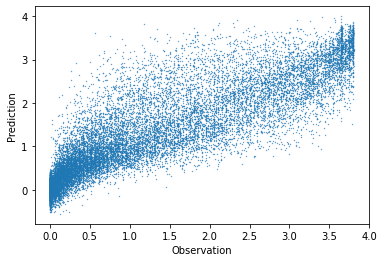

# Charging with PV Forecast


### Imports

```python
#exports
import numpy as np
import pandas as pd
import os
import matplotlib.pyplot as plt
import seaborn as sns
import joblib

from moepy.lowess import quantile_model

from sklearn.pipeline import Pipeline
from sklearn.linear_model import LinearRegression, Lasso, Ridge
from sklearn.metrics import make_scorer, r2_score, mean_absolute_error, mean_squared_error
from sklearn.ensemble import RandomForestRegressor, GradientBoostingRegressor
from sklearn.model_selection import GroupKFold


from mlxtend.feature_selection import SequentialFeatureSelector as SFS

from skopt.plots import plot_objective
from skopt.space import Real, Categorical, Integer

from batopt import clean, discharge, utils, charge

import FEAutils as hlp

from ipypb import track
```

<br>

### User inputs

```python
raw_data_dir = '../data/raw'
intermediate_data_dir = '../data/intermediate'
cache_data_dir = '../data/nb-cache'
charge_opt_model_fp = '../models/charge_opt.sav'
```

<br>

### Fitting forecast model

We'll first load the input data

```python
#exports
def construct_df_charge_features(df, dt_rng=None):
    if dt_rng is None:
        dt_rng = pd.date_range(df.index.min(), df.index.max(), freq='30T')
        
    df_features = pd.DataFrame(index=dt_rng)
    
    # Adding temperature data
    temp_loc_cols = df.columns[df.columns.str.contains('temp_location')]
    df_features.loc[df.index, temp_loc_cols] = df[temp_loc_cols].copy()
    df_features = df_features.ffill(limit=1)
    
    # Adding solar irradiance data
    solar_loc_cols = df.columns[df.columns.str.contains('solar_location')]
    df_features.loc[df.index, solar_loc_cols] = df[solar_loc_cols].copy()
    df_features = df_features.ffill(limit=1)
    
    # Adding avg solar from previous week
    df_features['pv_7d_lag'] = df['pv_power_mw'].rolling(48*7).mean().shift(48*7)

    # Adding datetime features
    dts = df_features.index

    df_features['hour'] = dts.hour + dts.minute/60
    df_features['doy'] = dts.dayofyear
    
    # Removing some extraneous features - found not be particularly useful
    cols = [c for c in df_features.columns if 'solar_location4' not in c and 'solar_location1' not in c]
    df_features = df_features.filter(cols)
    
    # Removing NaN values
    df_features = df_features.dropna()
    
    return df_features

def prepare_training_input_data(intermediate_data_dir, start_hour=5):
    # Loading input data
    df = clean.combine_training_datasets(intermediate_data_dir).interpolate(limit=1)
    df_features = construct_df_charge_features(df)
    
    # Filtering for overlapping feature and target data
    dt_idx = pd.date_range(df_features.index.min(), df['pv_power_mw'].dropna().index.max()-pd.Timedelta(minutes=30), freq='30T')

    s_pv = df.loc[dt_idx, 'pv_power_mw']
    df_features = df_features.loc[dt_idx]
        
    # Filtering for evening datetimes
    charging_datetimes = charge.extract_charging_datetimes(df_features, start_hour=start_hour)
    
    X = df_features.loc[charging_datetimes]
    y = s_pv.loc[charging_datetimes]
    
    return X, y
```

```python
X, y = prepare_training_input_data(intermediate_data_dir)

X.head()
```


|                           |   temp_location1 |   temp_location2 |   temp_location3 |   temp_location4 |   temp_location5 |   temp_location6 |   solar_location2 |   solar_location3 |   solar_location5 |   solar_location6 |   pv_7d_lag |   weekend |   dow |   hour |   doy |
|:--------------------------|-----------------:|-----------------:|-----------------:|-----------------:|-----------------:|-----------------:|------------------:|------------------:|------------------:|------------------:|------------:|----------:|------:|-------:|------:|
| 2017-11-17 05:00:00+00:00 |            3.79  |            4.28  |            2.97  |             1.25 |             9.3  |            9.77  |             0     |             0     |              0    |             0     |    0.334792 |         0 |     4 |    5   |   321 |
| 2017-11-17 05:30:00+00:00 |            3.555 |            3.95  |            2.82  |             0.98 |             9.31 |            9.755 |             0     |             0     |              0    |             0     |    0.334792 |         0 |     4 |    5.5 |   321 |
| 2017-11-17 06:00:00+00:00 |            3.32  |            3.62  |            2.67  |             0.71 |             9.32 |            9.74  |             0     |             0     |              0    |             0     |    0.334792 |         0 |     4 |    6   |   321 |
| 2017-11-17 06:30:00+00:00 |            3.255 |            3.535 |            2.675 |             0.78 |             9.34 |            9.74  |             0.155 |             0.075 |              0.12 |             0.255 |    0.334792 |         0 |     4 |    6.5 |   321 |
| 2017-11-17 07:00:00+00:00 |            3.19  |            3.45  |            2.68  |             0.85 |             9.36 |            9.74  |             0.31  |             0.15  |              0.24 |             0.51  |    0.334732 |         0 |     4 |    7   |   321 |</div>


<br>

We'll create a quick baseline PV forecast

```python
df_pred_LR = clean.generate_kfold_preds(X.values, y.values, RandomForestRegressor(), index=X.index)

df_pred_LR.head()
```


|                           |   pred |   true |
|:--------------------------|-------:|-------:|
| 2017-11-17 05:00:00+00:00 |      0 |      0 |
| 2017-11-17 05:30:00+00:00 |      0 |      0 |
| 2017-11-17 06:00:00+00:00 |      0 |      0 |
| 2017-11-17 06:30:00+00:00 |      0 |      0 |
| 2017-11-17 07:00:00+00:00 |      0 |      0 |</div>


<br>

Analysing the predictions

```python
plt.scatter(df_pred.true, df_pred.pred, s=0.1)
plt.xlabel('Observation')
plt.ylabel('Prediction')
```


    Text(0, 0.5, 'Prediction')





<br>

We'll also visualise what the prediction looks like for randomly selected days

```python
#exports
def plot_random_day(df_pred, ax=None):
    """
    View predicted and observed PV profiles
    """
    if ax is None:
        ax = plt.gca()
    
    random_day_idx = pd.to_datetime(np.random.choice(df_pred.index.date))
    df_random_day = df_pred[df_pred.index.date==random_day_idx]
    
    df_random_day['true'].plot(ax=ax)
    df_random_day['pred'].plot(ax=ax)
    
    return ax
```

```python
plot_random_day(df_pred)

plt.legend(frameon=False)
```


    <matplotlib.legend.Legend at 0x2c0e0225730>


<br>

We'll then carry out the second-stage for our model, the solar peak flattening

```python
random_solar_profile = discharge.sample_random_day(df_pred.pred).pipe(charge.extract_solar_profile)
adj_random_solar_profile = discharge.flatten_peak(random_solar_profile)
charge_profile = charge.construct_charge_profile(random_solar_profile, adj_random_solar_profile)

plt.plot(charge_profile)
```


    [<matplotlib.lines.Line2D at 0x1227af520>]


<br>

### Predicting charge based on PV forecast

Now we will begin developing a unified approach for predicting PV and then optimising the battery charge schedule. 

We will also group by week. This should make the problem a bit harder, and help encourage the final model to generalise to lengthy unseen periods.

```python
#exports
def generate_kfold_preds_weeks(X, y, model, groups, kfold_kwargs, index=None):
    """
    Generate kfold preds, grouping by week
    """
    
    group_kfold = GroupKFold(**kfold_kwargs)
    
    df_pred = pd.DataFrame(columns=['pred', 'true'], index=np.arange(X.shape[0]))

    for train_index, test_index in group_kfold.split(X, y, groups):
        X_train, X_test = X[train_index], X[test_index]
        y_train, y_test = y[train_index], y[test_index]

        model.fit(X_train, y_train)

        df_pred.loc[test_index, 'true'] = y_test
        df_pred.loc[test_index, 'pred'] = model.predict(X_test)

    df_pred.sort_index()

    if index is not None:
        assert len(index) == df_pred.shape[0], 'The passed index must be the same length as X and y'
        df_pred.index = index

    return df_pred
    
def generate_kfold_charge_preds(X, y, model, groups, kfold_kwargs={'n_splits': 5}):
    """
    Fit the PV forecasting model and calculate the optimal charge profile for predictions.
    """
    df_pred = generate_kfold_preds_weeks(X.values, y.values, model, groups, kfold_kwargs=kfold_kwargs, index=X.index)
    
    charge_pred = charge.construct_charge_s(df_pred.pred)
    charge_pred = charge.post_pred_charge_proc_func(charge_pred)
    
    return pd.DataFrame({'charge_pred': charge_pred, 
                         'pv_actual': df_pred.true,
                         'pv_pred': df_pred.pred})

def predict_charge(X, model):
    """
    Given a fitted PV forecast model and feature array X, get the optimal charge profile. 
    """
    pv_pred = pd.Series(model.predict(X), index=X.index)
    charge_pred = charge.construct_charge_s(pv_pred)
    charge_pred = charge.post_pred_charge_proc_func(charge_pred)
    return pd.Series(charge_pred, index=X.index)
```

<br>

We'll also create a helper function for our test/train split based on time

```python
#exports
def get_train_test_arr(arr, start_of_test_period): 
    train_arr = arr[:pd.to_datetime(start_of_test_period, utc=True)]
    test_arr = arr[pd.to_datetime(start_of_test_period, utc=True):]
    
    return train_arr, test_arr

def get_train_test_Xy(X, y, start_of_test_period): 
    x_train, x_test = get_train_test_arr(X, start_of_test_period)
    y_train, y_test = get_train_test_arr(y, start_of_test_period)
    
    return x_train, x_test, y_train, y_test
```

```python
start_of_test_period = '2019-02-04'

X_train, X_test, y_train, y_test = get_train_test_Xy(X, y, start_of_test_period)
```

<br>

Now let's try executing this unified approach using k-fold CV, for 3 default models on the training data:

```python
models = {
    'std_linear': LinearRegression(),
    'lasso': Lasso(),
    'ridge': Ridge(),
    'boosted': GradientBoostingRegressor(),
    'random_forest': RandomForestRegressor(),
}

# Define the week groups
week_groups = X_train.index.year + X_train.index.isocalendar().week/52

for key in models:
    charge_pred_df = generate_kfold_charge_preds(X_train, y_train, models[key], week_groups)
    score = charge.score_charging(charge_pred_df.charge_pred, charge_pred_df.pv_actual)
    pv_mse = np.mean(np.square(charge_pred_df.pv_actual - charge_pred_df.pv_pred))
    solar_exploit_pct = 100*charge.prop_max_solar(charge_pred_df.charge_pred, charge_pred_df.pv_actual)
    print("{}: PV MSE: {:.2f}, score: {:.2f}, solar exploit: {:.2f}%".format(key, pv_mse, score, solar_exploit_pct))
```

    std_linear: PV MSE: 0.35, score: 0.77, solar exploit: 94.86%
    lasso: PV MSE: 0.39, score: 0.76, solar exploit: 93.87%
    ridge: PV MSE: 0.35, score: 0.77, solar exploit: 94.86%
    boosted: PV MSE: 0.36, score: 0.77, solar exploit: 94.48%
    random_forest: PV MSE: 0.35, score: 0.76, solar exploit: 94.35%
    

<br>

Interestingly, there is little difference between the models in terms of solar exploit, even though there are some differences in the MSE of the PV forecasts. For our previous attempt at the charging task, the linear model was much worse than the boosted model and RF in terms of solar exploit. This suggests that a weak (or under-fitted) estimator of solar PV actually performs quite well when it comes to 

```python
best_model = RandomForestRegressor()
best_model.fit(X_train, y_train)
preds = predict_charge(X_test, best_model)
```

```python
100*charge.prop_max_solar(preds, y_test)
```


    95.64718850989254


```python
pd.Series(dict(zip(X_test.columns, best_model.feature_importances_))).sort_values(ascending=False)
```


    solar_location2    0.656734
    solar_location6    0.057420
    solar_location5    0.048603
    hour               0.036628
    pv_7d_lag          0.031805
    solar_location3    0.031244
    doy                0.030441
    temp_location4     0.019506
    temp_location6     0.018710
    temp_location5     0.016729
    temp_location1     0.014523
    temp_location3     0.013219
    dow                0.012169
    temp_location2     0.011155
    weekend            0.001112
    dtype: float64


Running the above analysis it seems like solar_locations 1 and 4 do not contribute much at all to the regression models: both are over an order of magnitude smaller than the others. Best to remove these when processing the data (for the moment this is `charge.py`

```python
features = [c for c in X_train.columns if 'solar_location4' not in c and 'solar_location1' not in c]
X_train_reduced, X_test_reduced = X_train.filter(features), X_test.filter(features)

charge_pred_df = generate_kfold_charge_preds(X_train_reduced, y_train, LinearRegression(), week_groups)
score = charge.score_charging(charge_pred_df.charge_pred, charge_pred_df.pv_actual)
pv_mse = np.mean(np.square(charge_pred_df.pv_actual - charge_pred_df.pv_pred))
solar_exploit_pct = 100*charge.prop_max_solar(charge_pred_df.charge_pred, charge_pred_df.pv_actual)
print("PV MSE: {:.2f}, score: {:.2f}, solar exploit: {:.2f}%".format(pv_mse, score, solar_exploit_pct))
```

<br>

### Tuned RF model

```python
rf_params = {
                    'criterion': 'mae',
                    'min_samples_leaf': 46,
                    'min_samples_split': 2,
                    'n_estimators': 150                    
                }
    
best_model = RandomForestRegressor(**rf_params)
best_model.fit(X_train, y_train)
preds = predict_charge(X_test, best_model)
```

```python
100*charge.prop_max_solar(preds, y_test)
```

```python
def construct_solar_exploit_calculator(solar_profile, charging_datetimes=None, scorer=False):
    if charging_datetimes is None:
        charging_datetimes = charge.extract_charging_datetimes(solar_profile)
            
    def calc_solar_exploitation(y, y_pred):
        # Checking evening datetimes
        if hasattr(y_pred, 'index') == True:
            charging_datetimes = charge.extract_charging_datetimes(y_pred)
            
        assert y_pred.shape[0] == solar_profile.loc[charging_datetimes].shape[0], f'The prediction series must be the same length as the number of charging datetimes in the main dataframe, {y_pred.shape[0]} {s_demand.loc[evening_datetimes].shape[0]}'
        
        charge_pred = charge.construct_charge_s(y_pred)
        charge_pred = charge.post_pred_charge_proc_func(charge_pred)
        
        exploitation_pct = 100 * charge.prop_max_solar(charge_pred, solar_profile.loc[charging_datetimes])

        return exploitation_pct

    if scorer == True:
        return make_scorer(calc_solar_exploitation)
    else:
        return calc_solar_exploitation
```

<br>

### Feature Selection

It seems like overfitting could be a substantial issue for charging. Trying some feature selection: 

```python
model = Lasso(alpha=0.5)
model.fit(X_train, y_train)
coefs_df = pd.DataFrame({'feature': X_train.columns,
              'coefs': model.coef_})
features = coefs_df[abs(coefs_df.coefs) > 0].feature
features
```


    9             solar_location5
    15    solar_location2_rolling
    16    solar_location3_rolling
    17    solar_location5_rolling
    18    solar_location6_rolling
    22     temp_location4_rolling
    Name: feature, dtype: object


```python
# features = [f for f in X_train.columns if 'temp' not in f]
```

```python
def prop_max_solar_df(charge_pred_df):
    return charge.prop_max_solar(charge_pred_df.charge_pred, charge_pred_df.pv_actual)

X_train_reduced = X_train.filter(features)

models = {
    'std_linear': LinearRegression(),
    'lasso': Lasso(),
    'boosted': GradientBoostingRegressor(),
    'random_forest': RandomForestRegressor(),
}

# Define the week groups
week_groups = X_train.index.year + X_train.index.isocalendar().week/52

for key in models:
    charge_pred_df = generate_kfold_charge_preds(X_train, y_train, models[key], week_groups)
    score = charge.score_charging(charge_pred_df.charge_pred, charge_pred_df.pv_actual)
    pv_mse = np.mean(np.square(charge_pred_df.pv_actual - charge_pred_df.pv_pred))    
    solar_exploit_pct = 100*charge_pred_df.groupby(charge_pred_df.index.date).apply(prop_max_solar_df)
    print("{}: PV MSE: {:.2f}, score: {:.2f}, solar exploit: {:.2f}%, std. solar exploit: {:.2f}".format(key, 
                                                                                                         pv_mse, 
                                                                                                         score, 
                                                                                                         solar_exploit_pct.mean(),
                                                                                                         solar_exploit_pct.std()))

```

    std_linear: PV MSE: 0.34, score: 0.77, solar exploit: 94.98%, std. solar exploit: 7.88
    lasso: PV MSE: 0.37, score: 0.76, solar exploit: 94.52%, std. solar exploit: 8.43
    boosted: PV MSE: 0.35, score: 0.77, solar exploit: 94.85%, std. solar exploit: 8.26
    random_forest: PV MSE: 0.35, score: 0.76, solar exploit: 94.74%, std. solar exploit: 8.35
    

```python
model = LinearRegression()
charge_pred_df = generate_kfold_charge_preds(X_train, y_train, model, week_groups)

fig, axs = plt.subplots(1,5, figsize=(15,3), dpi=125)

for i in range(5):
    random_day = pd.to_datetime(np.random.choice(charge_pred_df.index.date))
    random_df = charge_pred_df[charge_pred_df.index.date == random_day]
    random_df['pv_actual'].plot(ax=axs[i])
    random_df['charge_pred'].plot(ax=axs[i])
```


```python
#exports
def predict_charge(X, model):
    """
    Given a fitted PV forecast model and feature array X, get the optimal charge profile. 
    """
    pv_pred = pd.Series(model.predict(X), index=X.index)    
    charge_pred = charge.construct_charge_s(pv_pred)
    charge_pred = charge.post_pred_charge_proc_func(charge_pred)
        
    return pd.Series(charge_pred, index=X.index)
```

```python
model = LinearRegression()
model.fit(X_train, y_train)
pv_pred = model.predict(X_test)

charge_pred = predict_charge(X_test, model)

charge_pred_df = pd.DataFrame({'charge_pred': charge_pred,
              'pv_pred': pv_pred,
              'pv_actual': y_test})

solar_exploit_pct = 100*charge_pred_df.groupby(charge_pred_df.index.date).apply(prop_max_solar_df)

print("Held out solar exploit: {:.2f}%".format(solar_exploit_pct.mean(), ))
print("Held out solar exploit (std): {:.2f}".format(solar_exploit_pct.std(), ))

```

    Held out solar exploit: 93.98%
    Held out solar exploit (std): 8.19
    

```python
N=8

fig, axs = plt.subplots(1,N, figsize=(15,3), dpi=125, sharey=True)

for i in range(N):
    random_day = pd.to_datetime(np.random.choice(charge_pred_df.index.date, replace=True))
    random_df = charge_pred_df[charge_pred_df.index.date == random_day]
    
    axs[i].plot(random_df.pv_actual, c='b', alpha=1)
    axs[i].plot(random_df.pv_pred, c='b', linestyle='--', alpha=0.2)
    axs[i].plot(random_df.charge_pred, c='g')
    axs[i].axhline(2.5, c='r', linestyle=':')
    axs[i].set_xticks([])


```


```python
## X, y = prepare_training_input_data(intermediate_data_dir)

start_of_test_period = '2019-02-04'

X_train, X_test = get_train_test(X, start_of_test_period)
y_train, y_test = get_train_test(y, start_of_test_period)

charging_datetimes = charge.extract_charging_datetimes(X_train)
solar_exploit_scorer = construct_solar_exploit_calculator(solar_profile=y, 
                                                            charging_datetimes=charging_datetimes, 
                                                            scorer=True)
groups = charging_datetimes.date

pipeline = Pipeline([
    ('pandas_RF', utils.PandasRandomForestRegressor())
])

search_spaces = {
        'pandas_RF__min_samples_leaf': Integer(1, 20, 'uniform'),
        'pandas_RF__criterion': Categorical(['mse', 'mae']),
        'pandas_RF__n_estimators': Integer(10, 150, 'uniform'),
        'pandas_RF__max_features': Categorical(['auto', 'sqrt']),
        'pandas_RF__max_depth': Integer(5, 200, 'uniform'),
        'pandas_RF__min_samples_split': Integer(2, 10, 'uniform'),
        'pandas_RF__min_samples_leaf': Integer(1, 4, 'uniform'),
        'pandas_RF__bootstrap': Categorical([True, False])
}

opt = utils.BayesSearchCV(
    pipeline,
    search_spaces,
    n_iter=10,
    verbose=1,
    cv=4, 
    scoring=solar_exploit_scorer,
    n_jobs=-1
)

fit_BayesSearchCV = False

if fit_BayesSearchCV == True:
    opt.fit(X_train, y_train, groups=groups)

    print(f'validation score: {opt.best_score_}')
    print(f'held out score: {opt.score(X_test, y_test)}')
    print(f'best params: {opt.best_params_}')

    _ = plot_objective(opt.optimizer_results_[0])
    plt.show()
```

```python
#exports
def fit_and_save_pv_model(X, y, pv_model_fp, model_class=LinearRegression, **model_params):
    model = model_class(**model_params)
    model.fit(X, y)
    
    with open(pv_model_fp, 'wb') as fp:
        joblib.dump(model, fp)
        
    return
```

```python
#exports
#exports
def prepare_test_feature_data(raw_data_dir, intermediate_data_dir, test_start_date=None, test_end_date=None, start_time='08:00', end_time='23:59'):
    # Loading input data
    df = clean.combine_training_datasets(intermediate_data_dir).interpolate(limit=1)
    df_features = construct_df_charge_features(df)
    
    # Loading default index (latest submission)
    if test_end_date is None or test_start_date is None:
        index = discharge.load_latest_submission_template(raw_data_dir).index
    else:
        index = df_features[test_start_date:test_end_date].index
    
    # Filtering feature data on submission datetimes
    df_features = df_features.loc[index].between_time(start_time, end_time)
    
    return df_features

def optimise_test_charge_profile(raw_data_dir, intermediate_data_dir, pv_model_fp, test_start_date=None, test_end_date=None, start_time='08:00', end_time='23:59'):
    df_features = prepare_test_feature_data(raw_data_dir, intermediate_data_dir, test_start_date=test_start_date, test_end_date=test_end_date, start_time=start_time, end_time=end_time)
    charging_datetimes = charge.extract_charging_datetimes(df_features)
    X_test = df_features.loc[charging_datetimes]
    
    model = discharge.load_trained_model(pv_model_fp)
    charge_profile = predict_charge(X_test, model)
    
    s_charge_profile = pd.Series(charge_profile, index=charging_datetimes)
    s_charge_profile = s_charge_profile.reindex(df_features.index).fillna(0)
    s_charge_profile = charge.post_pred_charge_proc_func(s_charge_profile)
    
    assert charge.charge_is_valid(s_charge_profile), "Charging profile is invalid"
    
    return s_charge_profile
```

```python
pv_model_fp = '../models/pv_model.sav'
s_charge_profile = optimise_test_charge_profile(raw_data_dir, intermediate_data_dir, pv_model_fp)

s_charge_profile.plot()
```


    ---------------------------------------------------------------------------

    NameError                                 Traceback (most recent call last)

    <ipython-input-6-8db658a0274e> in <module>
          1 pv_model_fp = '../models/pv_model.sav'
    ----> 2 s_charge_profile = optimise_test_charge_profile(intermediate_data_dir, pv_model_fp)
          3 
          4 s_charge_profile.plot()
    

    NameError: name 'intermediate_data_dir' is not defined


<br>

Finally we'll export the relevant code to our `batopt` module
