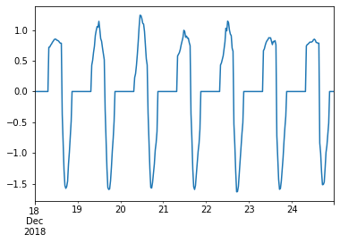

# Christmas


```python
#exports
import numpy as np
import pandas as pd

import os
from sklearn.ensemble import RandomForestRegressor

from batopt import clean, discharge, charge, constraints, pv
```

```python
import FEAutils as hlp
import matplotlib.pyplot as plt
```

<br>

### User Inputs

```python
raw_data_dir = '../data/raw'
intermediate_data_dir = '../data/intermediate'
```

<br>

### Christmas Model EDA

We'll start by loading in the combined training dataset

```python
df = clean.combine_training_datasets(intermediate_data_dir).interpolate(limit=1)

df.head()
```


|                           |   demand |   pv |   weather |   demand_MW |   irradiance_Wm-2 |   panel_temp_C |   pv_power_mw |   solar_location1 |   solar_location2 |   solar_location3 |   solar_location4 |   solar_location5 |   solar_location6 |   temp_location1 |   temp_location2 |   temp_location3 |   temp_location4 |   temp_location5 |   temp_location6 |   holidays |
|:--------------------------|---------:|-----:|----------:|------------:|------------------:|---------------:|--------------:|------------------:|------------------:|------------------:|------------------:|------------------:|------------------:|-----------------:|-----------------:|-----------------:|-----------------:|-----------------:|-----------------:|-----------:|
| 2015-01-01 00:00:00+00:00 |      nan |  nan |       nan |         nan |               nan |            nan |           nan |                 0 |                 0 |                 0 |                 0 |                 0 |                 0 |             9.75 |            9.65  |            8.83  |            7.58  |           11.62  |            11.22 |        nan |
| 2015-01-01 00:30:00+00:00 |      nan |  nan |       nan |         nan |               nan |            nan |           nan |                 0 |                 0 |                 0 |                 0 |                 0 |                 0 |             9.83 |            9.705 |            8.865 |            7.6   |           11.635 |            11.27 |        nan |
| 2015-01-01 01:00:00+00:00 |      nan |  nan |       nan |         nan |               nan |            nan |           nan |                 0 |                 0 |                 0 |                 0 |                 0 |                 0 |             9.91 |            9.76  |            8.9   |            7.62  |           11.65  |            11.32 |        nan |
| 2015-01-01 01:30:00+00:00 |      nan |  nan |       nan |         nan |               nan |            nan |           nan |                 0 |                 0 |                 0 |                 0 |                 0 |                 0 |             9.95 |            9.78  |            9     |            7.615 |           11.65  |            11.31 |        nan |
| 2015-01-01 02:00:00+00:00 |      nan |  nan |       nan |         nan |               nan |            nan |           nan |                 0 |                 0 |                 0 |                 0 |                 0 |                 0 |             9.99 |            9.8   |            9.1   |            7.61  |           11.65  |            11.3  |        nan |</div>


<br>

We'll now create our charge/discharge baseline for 2018

```python
test_start_date = '2018-12-18'
test_end_date = '2018-12-24 23:59'

discharge_opt_model_fp = '../models/discharge_opt.sav'
pv_model_fp = '../models/pv_model.sav'

model_params = {
    'criterion': 'mse',
    'bootstrap': True,
    'max_depth': 32,
    'max_features': 'auto',
    'min_samples_leaf': 1,
    'min_samples_split': 4,
    'n_estimators': 74  
}

X, y = pv.prepare_training_input_data(intermediate_data_dir)

if test_start_date is not None and test_end_date is not None:
    pred_index = X[test_start_date:test_end_date].index
    X = X.drop(pred_index)
    y = y.drop(pred_index)

pv.fit_and_save_pv_model(X, y, pv_model_fp, model_class=RandomForestRegressor, **model_params)

s_charge_profile = pv.optimise_test_charge_profile(raw_data_dir, intermediate_data_dir, pv_model_fp, test_start_date=test_start_date, test_end_date=test_end_date)
s_discharge_profile = discharge.optimise_test_discharge_profile(raw_data_dir, intermediate_data_dir, discharge_opt_model_fp, test_start_date=test_start_date, test_end_date=test_end_date)

s_battery_profile = (s_charge_profile + s_discharge_profile).fillna(0)
s_battery_profile.name = 'charge_MW'

s_battery_profile.plot()
```


    <AxesSubplot:>





<br>

As well as the current year we're meant to be forecasting

```python
test_start_date = None
test_end_date = None

discharge_opt_model_fp = '../models/discharge_opt.sav'
pv_model_fp = '../models/pv_model.sav'

model_params = {
    'criterion': 'mse',
    'bootstrap': True,
    'max_depth': 32,
    'max_features': 'auto',
    'min_samples_leaf': 1,
    'min_samples_split': 4,
    'n_estimators': 74  
}

X, y = pv.prepare_training_input_data(intermediate_data_dir)

if test_start_date is not None and test_end_date is not None:
    pred_index = X[test_start_date:test_end_date].index
    X = X.drop(pred_index)
    y = y.drop(pred_index)
    
pv.fit_and_save_pv_model(X, y, pv_model_fp, model_class=RandomForestRegressor, **model_params)

s_charge_profile = pv.optimise_test_charge_profile(raw_data_dir, intermediate_data_dir, pv_model_fp, test_start_date=test_start_date, test_end_date=test_end_date)
s_discharge_profile = discharge.optimise_test_discharge_profile(raw_data_dir, intermediate_data_dir, discharge_opt_model_fp, test_start_date=test_start_date, test_end_date=test_end_date)

s_battery_profile = (s_charge_profile + s_discharge_profile).fillna(0)
s_battery_profile.name = 'charge_MW'

s_battery_profile.plot()
```


    ---------------------------------------------------------------------------

    KeyError                                  Traceback (most recent call last)

    <ipython-input-9-81823d82d537> in <module>
         24 pv.fit_and_save_pv_model(X, y, pv_model_fp, model_class=RandomForestRegressor, **model_params)
         25 
    ---> 26 s_charge_profile = pv.optimise_test_charge_profile(raw_data_dir, intermediate_data_dir, pv_model_fp, test_start_date=test_start_date, test_end_date=test_end_date)
         27 s_discharge_profile = discharge.optimise_test_discharge_profile(raw_data_dir, intermediate_data_dir, discharge_opt_model_fp, test_start_date=test_start_date, test_end_date=test_end_date)
         28 
    

    c:\users\ayrto\desktop\hackathons\wpd-ds-challenge\batopt\pv.py in optimise_test_charge_profile(raw_data_dir, intermediate_data_dir, pv_model_fp, test_start_date, test_end_date, start_time, end_time)
        142 # Cell
        143 def optimise_test_charge_profile(raw_data_dir, intermediate_data_dir, pv_model_fp, test_start_date=None, test_end_date=None, start_time='08:00', end_time='23:59'):
    --> 144     df_features = charge.prepare_test_feature_data(raw_data_dir, intermediate_data_dir, test_start_date=test_start_date, test_end_date=test_end_date, start_time=start_time, end_time=end_time)
        145     charging_datetimes = charge.extract_charging_datetimes(df_features)
        146     X_test = df_features.loc[charging_datetimes]
    

    c:\users\ayrto\desktop\hackathons\wpd-ds-challenge\batopt\charge.py in prepare_test_feature_data(raw_data_dir, intermediate_data_dir, test_start_date, test_end_date, start_time, end_time)
        280 
        281     # Filtering feature data on submission datetimes
    --> 282     df_features = df_features.loc[index].between_time(start_time, end_time)
        283 
        284     return df_features
    

    ~\anaconda3\envs\batopt\lib\site-packages\pandas\core\indexing.py in __getitem__(self, key)
        892 
        893             maybe_callable = com.apply_if_callable(key, self.obj)
    --> 894             return self._getitem_axis(maybe_callable, axis=axis)
        895 
        896     def _is_scalar_access(self, key: Tuple):
    

    ~\anaconda3\envs\batopt\lib\site-packages\pandas\core\indexing.py in _getitem_axis(self, key, axis)
       1110                     raise ValueError("Cannot index with multidimensional key")
       1111 
    -> 1112                 return self._getitem_iterable(key, axis=axis)
       1113 
       1114             # nested tuple slicing
    

    ~\anaconda3\envs\batopt\lib\site-packages\pandas\core\indexing.py in _getitem_iterable(self, key, axis)
       1050 
       1051         # A collection of keys
    -> 1052         keyarr, indexer = self._get_listlike_indexer(key, axis, raise_missing=False)
       1053         return self.obj._reindex_with_indexers(
       1054             {axis: [keyarr, indexer]}, copy=True, allow_dups=True
    

    ~\anaconda3\envs\batopt\lib\site-packages\pandas\core\indexing.py in _get_listlike_indexer(self, key, axis, raise_missing)
       1263             keyarr, indexer, new_indexer = ax._reindex_non_unique(keyarr)
       1264 
    -> 1265         self._validate_read_indexer(keyarr, indexer, axis, raise_missing=raise_missing)
       1266         return keyarr, indexer
       1267 
    

    ~\anaconda3\envs\batopt\lib\site-packages\pandas\core\indexing.py in _validate_read_indexer(self, key, indexer, axis, raise_missing)
       1305             if missing == len(indexer):
       1306                 axis_name = self.obj._get_axis_name(axis)
    -> 1307                 raise KeyError(f"None of [{key}] are in the [{axis_name}]")
       1308 
       1309             ax = self.obj._get_axis(axis)
    

    KeyError: "None of [DatetimeIndex(['2020-07-03 00:00:00+00:00', '2020-07-03 00:30:00+00:00',\n               '2020-07-03 01:00:00+00:00', '2020-07-03 01:30:00+00:00',\n               '2020-07-03 02:00:00+00:00', '2020-07-03 02:30:00+00:00',\n               '2020-07-03 03:00:00+00:00', '2020-07-03 03:30:00+00:00',\n               '2020-07-03 04:00:00+00:00', '2020-07-03 04:30:00+00:00',\n               ...\n               '2020-07-09 19:00:00+00:00', '2020-07-09 19:30:00+00:00',\n               '2020-07-09 20:00:00+00:00', '2020-07-09 20:30:00+00:00',\n               '2020-07-09 21:00:00+00:00', '2020-07-09 21:30:00+00:00',\n               '2020-07-09 22:00:00+00:00', '2020-07-09 22:30:00+00:00',\n               '2020-07-09 23:00:00+00:00', '2020-07-09 23:30:00+00:00'],\n              dtype='datetime64[ns, UTC]', name='datetime', length=336, freq=None)] are in the [index]"


```python
fig, ax = plt.subplots(dpi=150)

for year in [2017, 2018]:
    start_date = f'{year}-12-18'
    end_date = f'{year}-12-24 23:59'
    
    s_discharge = discharge.construct_discharge_s(df.loc[start_date:end_date, 'demand_MW'])
    plt.plot(s_discharge.iloc[:48*7].values, label=f'{year}')
    
plt.plot(s_discharge_profile.iloc[:48*7].values, linestyle='--', label='2019 Prediction')

plt.legend(frameon=False, bbox_to_anchor=(1, 1))
hlp.hide_spines(ax)
```

```python
for year in [2017, 2018]:
    start_date = f'{year}-12-18'
    end_date = f'{year}-12-24 23:59'
    
    s_discharge = discharge.construct_discharge_s(df.loc[start_date:end_date, 'demand_MW'])
    plt.plot(s_discharge.iloc[:48*7].values)
```
